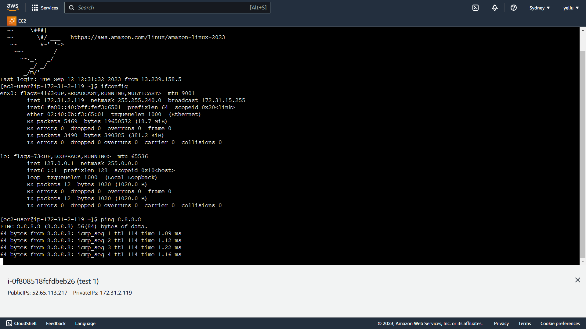
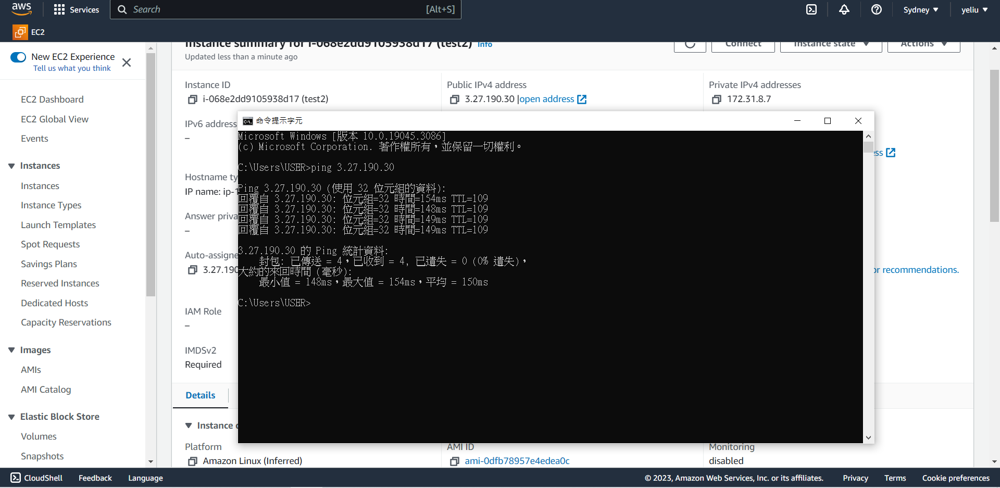
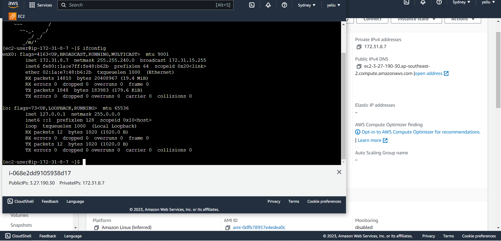

# 第一周
## 雲端服務提供的資源
* ### 計算 
  在雲端開設虛擬機，可以有多台，可以根據自己需求配置機器運算效果  
  * 好處:
   用多少收多少錢
* ### 儲存
* ### 網路
## 正常的架構
伺服器去資料庫把資料擷取出來，再回傳到客戶端 
* 缺點: 
速度慢(資料庫可能存在於傳統硬碟，傳統硬碟讀取較慢) 
* 解決方式: 
在網頁伺服器跟資料庫之間做一個快取資料庫(momcache)
## AWS 
* EC2 
好處:自動監控
* S3 STORAGE 
儲存、網站
* npc 
網路
## 註冊

## 創建虛擬機
取名 ↓ 
選擇作業系統 ↓ 
選擇實體類型 ↓ 
選擇或創建key pair(ssh連線需要) 
(linux傳過來用.pem，windows傳過來用.ppk) ↓ 
設置網路 
(Auto-assing public IP設置成Enable才能聯網) ↓ 
設置防火牆 
(名字不能有"-") ↓ 
選擇什麼網路可以進來 ↓ 
選擇SSD ↓ 
點擊創建 ↓ 
創建完成

能成功聯網，也能ping進來

