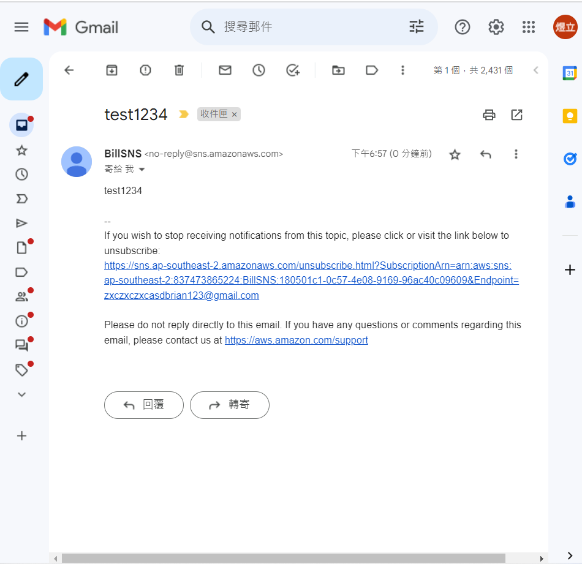
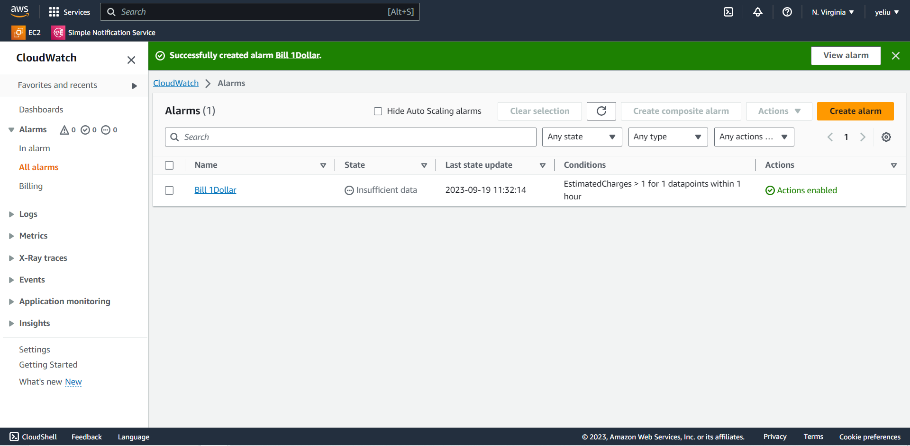
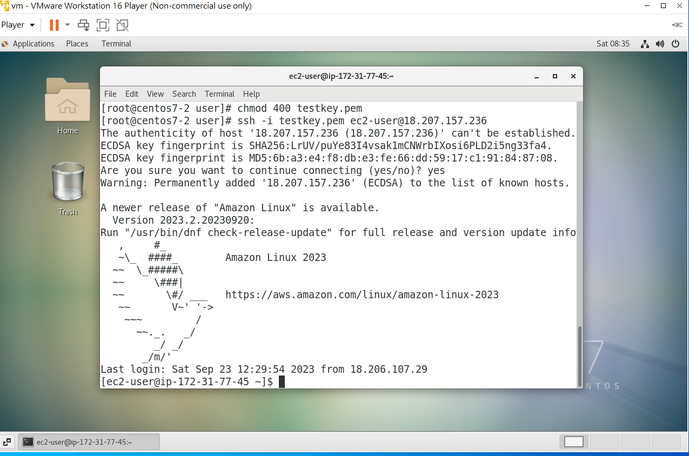
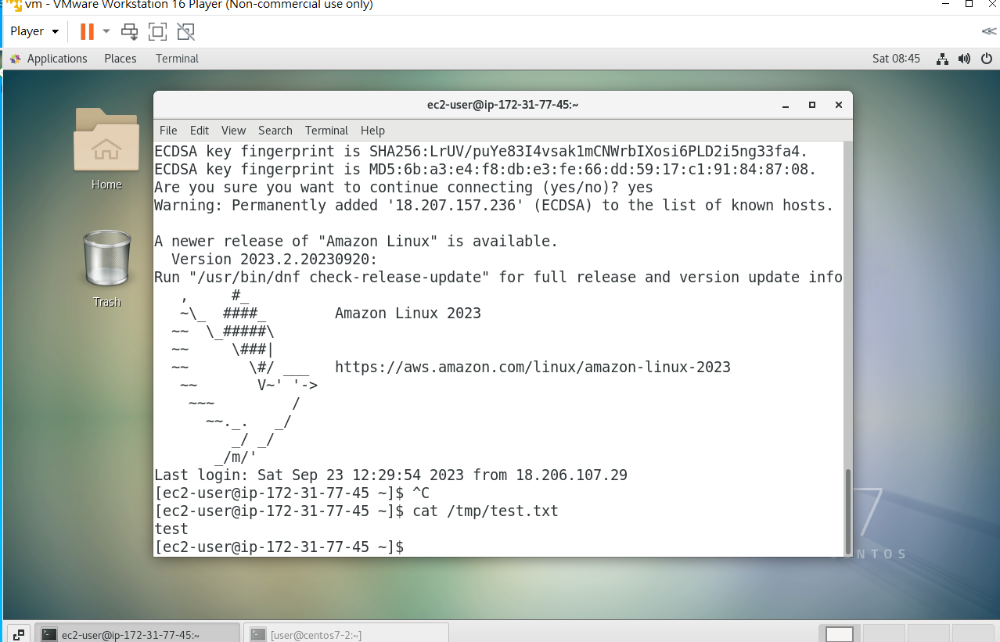

# 第二周
# SNS
* 建立在發行者跟訂閱者的基礎上
* 通訊分成同步與非同步
# SNS架構
* Queue對應著不同主題
* 發佈者:根據內容不同，把東西放在相對應的Queue裡。
* 訂閱者:根據訂閱的主題收到不一樣的消息。
# 如何使用SNS
## 創造主題(Topics)
 選擇類型 
* FIFO(誰先進來誰先出去)
* Standard

 ↓ 

取名 
## 創造訂閱者
選擇通知方式(email)  ↓ 
增加email信箱

## 測試
點擊Publish message  ↓ 
寫寄信的主題、內容  ↓ 
送出  ↓ 
登入email信箱查看  ↓ 
成功收到

#注:不同的地區訂閱者及主題不互通

# 監控帳單
## CloudWatch
alarm下的Billing  ↓ 
Create alarm  ↓ 
Select Metrics  ↓ 
Billing ↓ 
Total Estimated Charge  ↓ 
設定警示金額  ↓ 
設定預測時間  ↓ 
把警告送到一個存在的SNS主題  ↓  
設定警告帳單名稱  ↓ 
創建成功  

# EC2
## EC2Dashboard
每次用完時檢查兩項要0，不然會開始收費
* Instances(running)
* Elastic IPs

## SSH連線
打開另一台虛擬機 ↓  
使用WinSCP用SFTP連線連進去  ↓  
上傳EC2的key pair到虛擬機  ↓  
裡把key pair權限改成為400(只有讀取權限) 
(chmod 400 (keypair name).pem)  ↓  
ssh -i (keypair name).pem ec2-user@(ec2虛擬機IP)  
成功連接

在虛擬機打開另一個terminal ↓  
新增檔案  
echo "test" > test.txt  ↓ 
傳送檔案  
scp -i (keypair).pem test.txt ec2-user@(ec2虛擬機IP):/tmp  ↓ 
回到已經連上ec2的terminal ↓ 
查看上傳檔案內容  
cat /tmp/test.txt  
成功上傳

