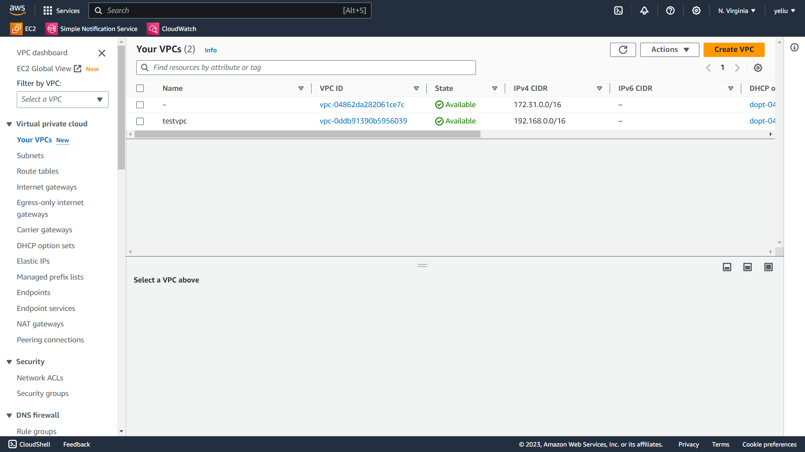
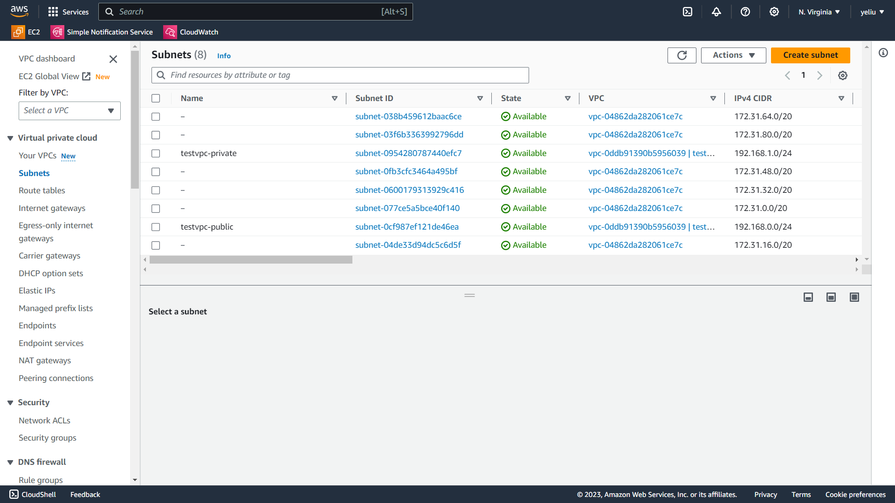
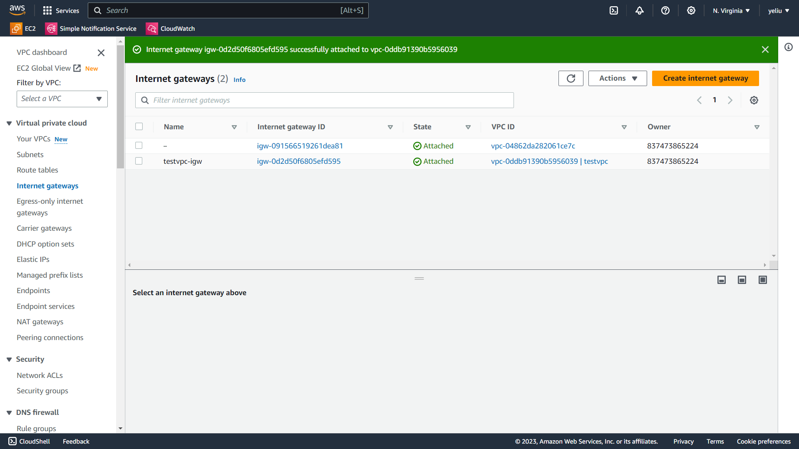
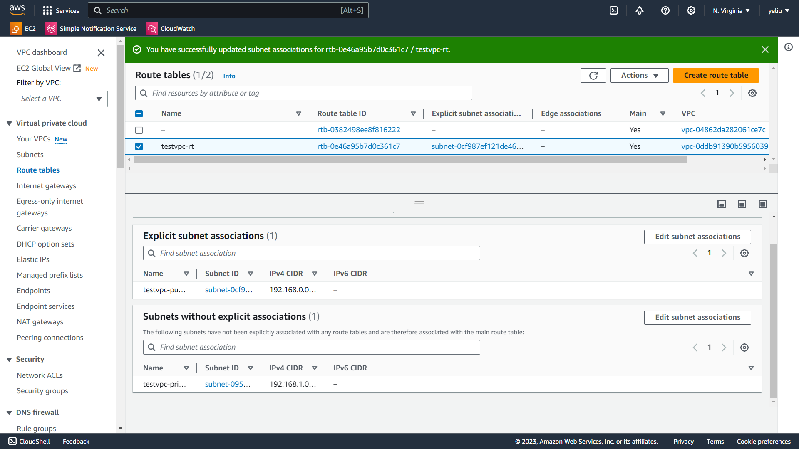
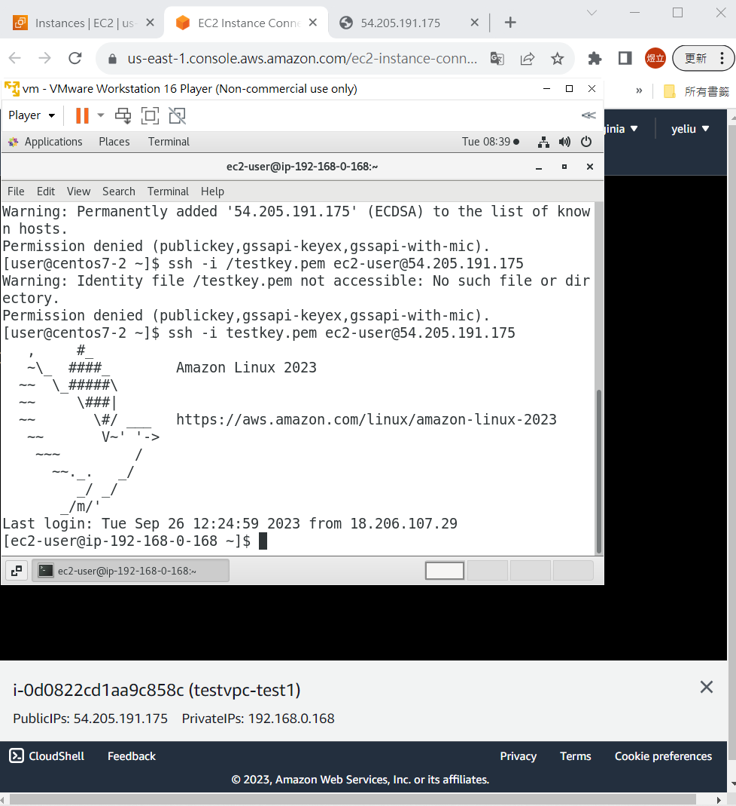
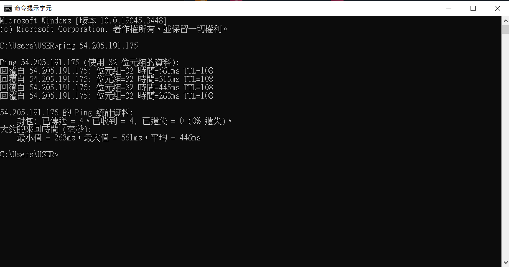
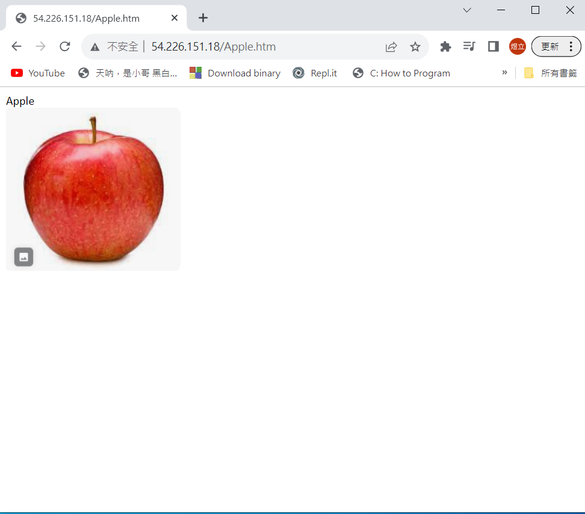

# 第三周
# Regions
* 全世界有31個AWS區域
* AZ(Available Zone)
  * 並非一個AWS區域只有一個可用區，有些地方可能有3~4個或更多
  * 在地理位置上作用於都市的不同地方，若發生天災人禍，可以用其他可用區
  * 分散風險
# VPC(Vitual Private Computing)
* 架設自己的虛擬雲端中心
* 在VPC中，架設不同的subnet
* subnet可以對應不同的AZ
* 客戶端與雲端VPC盡量在同一區域，節省傳輸時間
* 可因應當地政府政策(如資料不能流出國家等)選擇區域
# IAM(Identity and Access Management)
* 有關存取權限設定
* 全球性的
# S3(Simple Storage Service)
* 儲存
* 全球性的
# NACL(Network Access Control List)
* 控管進出subnet的流量
* 近來及出去的資料都會檢查
* 無狀態保護
# SG(Secunity Group)
* 控管進出虛擬機的流量
* 只要知道進來時流量檢查過了，就不會檢查出去的資料，會直接放行
* 有狀態保護
# IGW(Internet GateWay)
* 可讓Public Network透過它連到外面
* 外面的人可用它連到Public Network的虛擬機
* NAT GW
  * 讓私有網路下的VM連到網際網路上
 # ENI(Elastic Network Interface)
 * 網路介面(虛擬)，可手動創建出來
 * 可綁定Public IP，提供對外的網路
 # ASG(Auto Scaling Group)
 * 可根據指標，自動增減虛擬機數量
 # 創建VPC
 VPC<br>↓<br>
 Your vpc<br>↓<br>
 Create VPC<br>↓<br>
 VPC only <br>↓<br>
 取名 <br>↓<br>
 IPV4 CIDR <br>
 (192.168.0.0/16)<br>↓<br>
 NO IPV6 CIDR block<br>↓<br>
 Create VPC <br>
 * 創建成功
 
 
 # 創建Public Network / Private Network
 Subnets<br>↓<br>
 Create subnet<br>↓<br>
 選擇VPC ID(剛剛創建的VPC名稱) <br>↓<br>
 取名<br>
 (testvpc-public) <br>↓<br>
 選擇區域(1a) <br>↓<br>
 IPV4 CIDR <br>
 (192.168.0.0/24)<br>↓<br>
 Add new subnet(再創建一個私網) <br>↓<br>
 取名<br>
 (testvpc-private) <br>↓<br>
 選擇區域(1b) <br>↓<br>
 IPV4 CIDR <br>
 (192.168.1.0/24)<br>↓<br>
 Create Subnet <br>
 * 創建成功
 

 # 創建IGW
 internet gateways<br>↓<br>
 Create internet gateway <br>↓<br>
 取名<br>
 (testvpe-igw)<br>↓<br>
 Create internet gateways<br>↓<br>
 Attach to a VPC<br>↓<br>
 選擇testvpc <br>↓<br>
 Attach internet gateway<br>
 * 創建成功
 

 # 編輯Route
 Route tables <br>↓<br>
 編輯名字<br>
 (testvpc-rt)<br>↓<br>
 勾選testvpc-rt<br>↓<br>
 Routes <br>↓<br>
 Edit routes<br>↓<br>
 Add routes<br>↓<br>
 0.0.0.0/0 <br>↓<br>
 選擇Internet Gateway<br>
 (igw-   )<br>↓<br>
 Save changes <br>↓<br>
 Subnet associations <br>↓<br>
 Edit subnet associations <br>↓<br>
 勾選testvpc-public <br>↓<br>
 Save associations<br>
 * 完成
 

 # 創建EC2
 改以下地方，其他照舊:<br>
 * Network settings
    VPC (選擇testvpc) <br>↓<br>
    Subneet(選擇testvpc-public) <br>↓<br>
    Auto-assign public IP (Enable) <br>↓<br>
    Security group (sg_testvpc_ssh_http)<br>↓<br>
    ssh <br>↓<br>
    Anywhere<br>↓<br>
    Add security group rule <br>↓<br>
    HTTP <br>↓<br>
    Anywhere <br><br>
 * Advanced details
    User data-optioinal打上:<br>
    ```sh
   #!/bin/bash
   yum update -y
   yum install -y httpd.x86_64
   systemctl start httpd.service
   systemctl enable httpd.service
   echo “Hello World from $(hostname -f)” > /var/www/html/index.html 
   Launch instance
    ```
   創建完成<br>
   在瀏覽器輸入EC2的Public IP(http:)<br>

    虛擬機連接EC2<br>
    ssh -i testkey.pem ec2-user@Public IP
   

 # 如何讓cmd成功ping上EC2
   在EC2 instance勾選 testvpc <br>↓<br>
   Security <br>↓<br>
   Security group <br>↓<br>
   Edit inbound rules<br>↓<br>
   Add rules <br>↓<br>
   All ICMY - IPV4 <br>↓<br>
   Anywhere <br>↓<br>
   Save rules<br>
   * 成功連上<br>
    
 # 新增網頁
    進入EC2虛擬機
    cd /var/www/htm
    ls 
    sudo bash -c 'echo "hi" > hi.htm' 
    cat hi.htm 
    到網頁輸入: Public IP/hi.htm 
  # 新增網頁(圖片)
   到word輸入需要的內容<br>↓<br>
   儲存成網頁(.htm) <br>↓<br>
   使用winscp把2個網頁檔上傳至虛擬機 <br>↓<br>
   另開一個terminal <br>↓<br>
   ls確認檔案是否上傳<br>↓<br>
   scp -i testkey.pem apple.htm ec2-user@3.89.30.86:/tmp <br>↓<br>
   scp -i testkey.pem -r apple.files ec2-user@3.89.30.86:/tmp <br>
   (因為是目錄，所以要-r) <br>↓<br>
   切換至ec2<br>↓<br>
   sudo mv apple.htm /var/www/html <br>↓<br>
   sudo mv apple.files/ /var/www/html <br>↓<br>
   打開網頁，輸入:<br>
   Public IP/apple.htm
   * 成功完成
   
