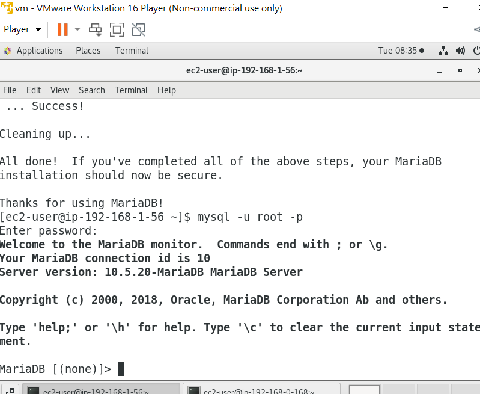
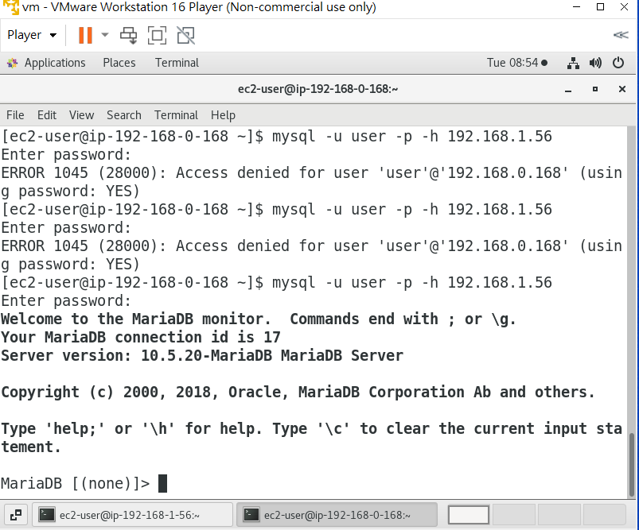

# 第四周
# 複習架構
* 創建一個虛擬雲端中心，裡面有公開網路及私有網路
* 為了讓公開網路能與外界網路連接，需要安裝IGW，設定路由表綁定

# 這周做的事
* 讓虛擬機直接擁有一個public ip
* 創造另一台虛擬機，使公開網路及私有網路的虛擬機互相交流
* 在私有網路的虛擬機創建資料庫
* mariadb透過NATGW、IGW連到網際網路

# 顯示Public ip
VPC <br>↓<br>
Subnets <br>↓<br>
testvpc-public打勾<br>↓<br>
Edit subnet setting<br>↓<br>
勾選 Enable auto-assign public IPv4 address<br>↓<br>
Save<br>
Auto-assign public IPv4 address應顯示YES

# 建立資料庫虛擬機(內網)
開機上禮拜的Ec2網頁虛擬機<br>↓<br>
新建另一台用來裝資料庫的虛擬機(網路是私有網路，不要公有網路)<br>↓<br>
新增MYSQL/AURORA規則<br>↓<br>
創建

# 打開公有及私有網路虛擬機

## 利用VMware連接公有網路vpc
ssh -i testkey.pem ec2-user@(網頁的Public IPv4 address ip)

## 利用VMware連接私有網路vpc
另開一終端機<br>↓<br>
scp -i ./testkey.pem testkey.pem ec2-user@(網頁的Public IPv4 address ip):/home/ec2-user testkey.pem<br>↓<br>
ssh -i testkey.pem ec2-user@(網頁的Public IPv4 address ip)<br>↓<br>
ssh -i testkey.pem ec2-user@(資料庫的Private IPv4 address ip)<br>↓<br>
成功連接
 

 # 使DB虛擬機能聯外網
 
 > 創建NATgw
```sh
 到VPC上
 NAT gateways
 Create NAT gateway
 取名 natgw-testvpc
 Subnet選擇(testvpc-public)
 Connectivity type選擇Public
 Elastic IPallocation ID 直接按旁邊的Allocate Elastic IP
 Create NAT gateway
 創建完成<br>
 ```

 > 創建內定路由表
 ```sh
 Route tables 
 Create route tables 
 取名rt-testvpc-private 
 VPC選擇(testvpc) 
 Create route tables 
 選擇rt-testvpc-private
 Edit routes 
 Add route
 Target選擇NAT gateway
 選擇剛才創建的natgw-testvpc 
 Save changes
 創建完成
```

 > 套用路由表

```sh
 Route tables
 勾選rt-testvpc-private 
 Subnet associations 
 Edit subnet associations 
 打勾testvpc-private 
 Save associations
 回到DB虛擬機上
 ping 8.8.8.8
```
 成功連接外網
 

 # 安裝Mariadb
 安裝Mariadb教學:https://linux.how2shout.com/installing-mariadb-on-amazon-linux-2023/ <br><br>
 到DB虛擬機裡(IP為1)<br>↓<br>
 sudo dnf install mariadb105-server <br>↓<br>
 sudo systemctl start mariadb <br>↓<br>
 sudo systemctl enable mariadb <br>↓<br>
 sudo systemctl status mariadb <br>↓<br>
 sudo mysql_secure_installation <br>↓<br>
 密碼直接Enter <br>↓<br>
 Switch to unix socket authentication? <br>
 n <br>
 Change the root password?<br>
 Y <br>
 123456 輸入2次 <br>
 Remove anonymous user? <br>
 Y<br>
 Disallow root login remotely? <br>
 n <br>
 Remove test database and access to it?<br>
 Y <br>
 Reload privilege tables now? <br>
 Y<br>
 
 # 啟動DB
 mysql -u root -p <br>↓<br>
 123456<br>↓<br>
 成功登錄
 

 # 創建DB user
 登錄後<br>
 CREAETE USER user@'%' IDENTIFIED BY 'user';<br>↓<br>
 GRANT ALL PRIVILEGES ON * . * TO 'user'@'%'; (給予權限) <br>↓<br>
 FLUSH PRIVILEGES;(更新資料庫權限) <br>↓<br>
 創建完成<br>

 # 在網頁虛擬機裡登錄DB
 網頁虛擬機的終端機<br>
 sudo yum install mariadb105<br>↓<br>
 mysql -u user -p -h (資料庫的Private IPv4 address ip)<br>↓<br>
 password:user <br>↓<br>
 成功登錄


 # 關閉 NAT gateway
 VPC <br>↓<br>
 NAT gateways <br>↓<br>
 勾選natgw-testvpc <br>↓<br>
 Actions<br>↓<br>
 Delete NAT gateway

 # 關閉私有網路的路由表
 VPC <br>↓<br>
 Route tables <br>↓<br>
 勾選rt-testvpc-private <br>↓<br>
 Subnet associations <br>↓<br>
 Edit subnet associations <br>↓<br>
 取消勾選testvpc-private <br>↓<br>
 Save associations <br>↓<br>
 Actions <br>↓<br>
 Delete route tables
 


 
