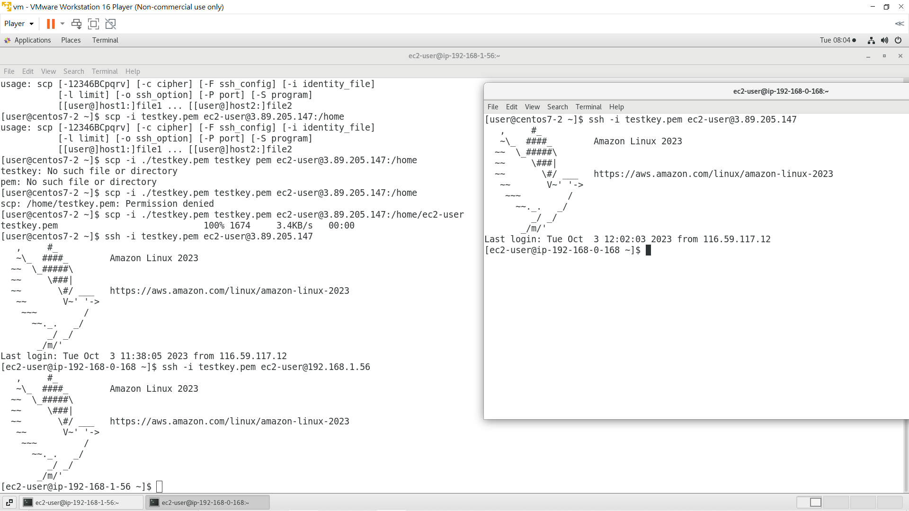
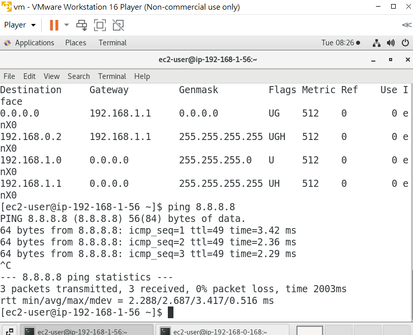

# 第四周
# 複習架構
* 創建一個虛擬雲端中心，裡面有公開網路及私有網路
* 為了讓公開網路能與外界網路連接，需要安裝IGW，設定路由表綁定

# 這周做的事
* 讓虛擬機直接擁有一個public ip
* 創造另一台虛擬機，使公開網路及私有網路的虛擬機互相交流
* 在私有網路的虛擬機創建資料庫
* mariadb透過NATGW、IGW連到網際網路

# 顯示Public ip
VPC  ↓ 
Subnets  ↓ 
testvpc-public打勾 ↓ 
Edit subnet setting ↓ 
勾選 Enable auto-assign public IPv4 address ↓ 
Save 
Auto-assign public IPv4 address應顯示YES

# 建立資料庫虛擬機(內網)
開機上禮拜的Ec2網頁虛擬機 ↓ 
新建另一台用來裝資料庫的虛擬機(網路是私有網路，不要公有網路) ↓ 
新增MYSQL/AURORA規則 ↓ 
創建

# 打開公有及私有網路虛擬機

## 利用VMware連接公有網路vpc
ssh -i testkey.pem ec2-user@(網頁的Public IPv4 address ip)

## 利用VMware連接私有網路vpc
另開一終端機 ↓ 
scp -i ./testkey.pem testkey.pem ec2-user@(網頁的Public IPv4 address ip):/home/ec2-user testkey.pem ↓ 
ssh -i testkey.pem ec2-user@(網頁的Public IPv4 address ip) ↓ 
ssh -i testkey.pem ec2-user@(資料庫的Private IPv4 address ip) ↓ 
成功連接
 

 # 使DB虛擬機能聯外網
 
 * 創建NATgw 
 到VPC上 ↓ 
 NAT gateways ↓ 
 Create NAT gateway ↓ 
 取名 natgw-testvpc ↓ 
 Subnet選擇(testvpc-public) ↓ 
 Connectivity type選擇Public ↓ 
 Elastic IPallocation ID 直接按旁邊的Allocate Elastic IP ↓ 
 Create NAT gateway ↓ 
 創建完成 
 
 * 創建內定路由表 
 Route tables  ↓ 
 Create route tables  ↓ 
 取名rt-testvpc-private  ↓ 
 VPC選擇(testvpc)  ↓ 
 Create route tables  ↓ 
 選擇rt-testvpc-private  ↓ 
 Edit routes  ↓ 
 Add route ↓ 
 Target選擇NAT gateway ↓ 
 選擇剛才創建的natgw-testvpc  ↓ 
 Save changes ↓ 
 創建完成 

 *套用路由表
 Route tables ↓ 
 勾選rt-testvpc-private  ↓ 
 Subnet associations  ↓ 
 Edit subnet associations ↓  
 打勾testvpc-private  ↓ 
 Save associations ↓ 
 回到DB虛擬機上 ↓ 
 ping 8.8.8.8 ↓ 
 成功連接外網
 
