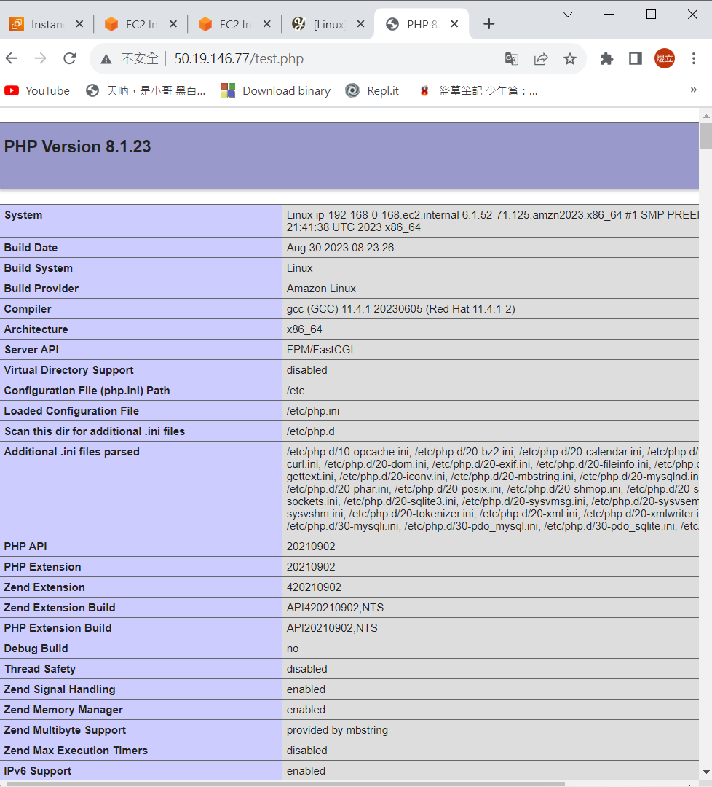
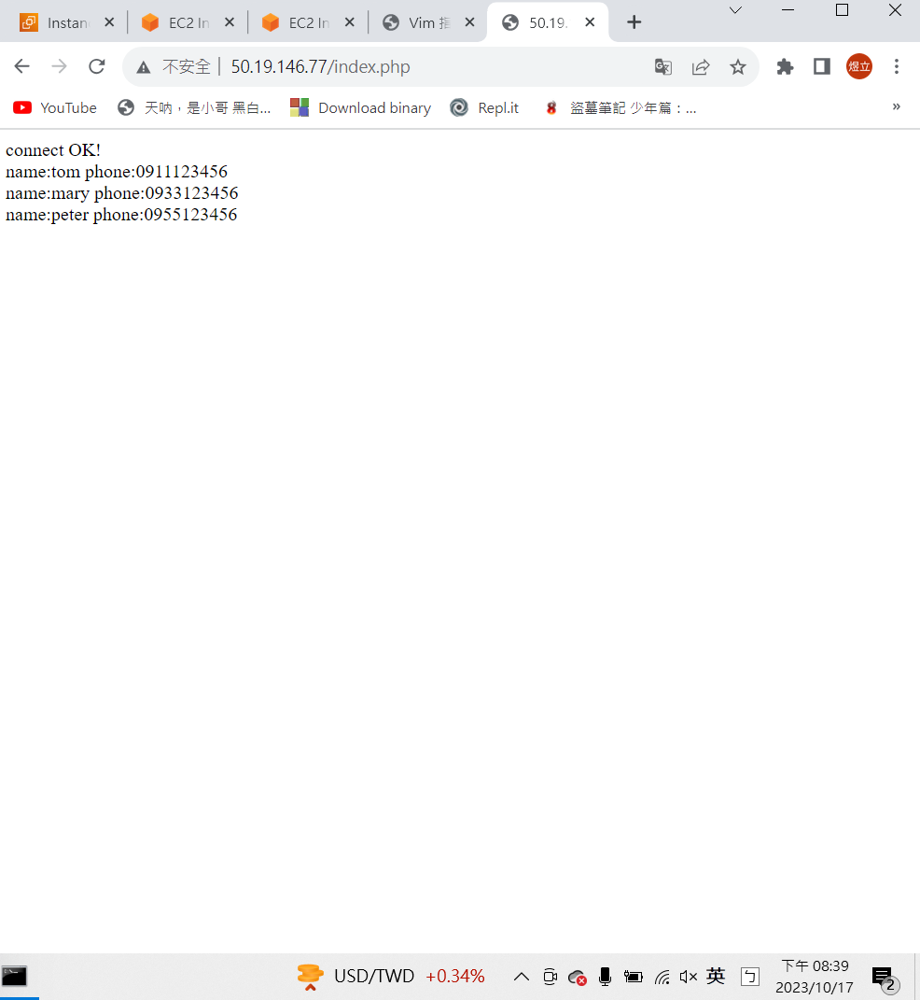

# 第五周  在網頁建立資料庫
# 打開網頁及資料庫機器
 

# 在Mariadb建資料
指令教學:https://github.com/stereomp3/note/blob/main/linux/111semester01/13-.md#MYSQL<br><br>
* 查看資料庫清單 : show database;
* 創建資料庫 : create database testdb; (testdb為想創建的資料庫名稱)
* 使用資料庫 : use testdb; (use + 資料庫名稱)
* 創建表格 : create table addressbook (name varchar(50) not null, phone char(10)); <br>
(create table + 表格名稱，姓名最長50字元且不得為空，電話號碼最長10字元)<br>
* 輸入資料 : insert into addressbook (name, phone) values ("tom", "0912123456");<br>
(insert into + 表格名稱 + (輸入的欄位) + value + ("輸入的資料", "輸入的資料)<br>


* 查詢資料 : select name,phone from addressbook where name="tom";<br>
(select (欲查詢欄位) from (表格名稱) where (查詢特定資料))<br>
* 更改資料 : update addressbook set phone="0911123456" where name="tom";<br>
(update (表格名稱) set (欲更改的資料) where (特定人))<br>


# 從遠端連線SQL
```sh
mysql -u user -p -h (資料庫IP)
use testdb;
select name,phone from address;
```
# 安裝網頁伺服器
```sh
sudo yum install httpd -y
```
# 安裝PHP
```sh
sudo yum instal php8.1 php8.1-fpm.x86_64 php8.1-mysqlnd.x86_64 -y
```

# 編輯網頁
```sh
cd /var/www/html
su
(使用root方便編輯)
vim test.php
<?php phpinfo() ?>
(編輯檔案)
systemctl restart httpd
(安裝完需重新啟動)
```
完成編輯


 # 使資料庫顯示在網頁上
> 編輯index.php

 vim index.php
 ```sh
<?php
$servername="192.168.1.56";(資料庫私網IP)
$username="user";    
$password="USER";
$dbname="testdb";

$conn = new mysqli($servername, $username, $password, $dbname);

if($conn->connect_error){
    die("connection failed: " . $conn->connect_error);
}
else{
    echo "connect OK!" . "<br>";
}

$sql="select name,phone from addressbook";
$result=$conn->query($sql);

if($result->num_rows>0){
    while($row=$result->fetch_assoc()){
        echo "name: " . $row["name"] . "\tphone: " . $row["phone"] . "<br>";
    }
} else {
    echo "0 record";
}
?>
```
* 完成

# 

