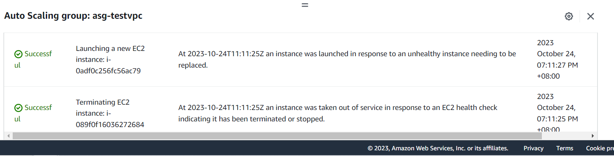
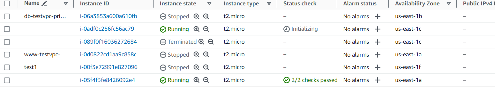

# 第六周
# Auto scaling Group(ASG)
* 自動擴張縮小雲端機器
* 客戶數量多時，有水平(horizontal)及垂直(vertical)兩種策略
  * 垂直策略:把本身機器效能往上提，只有一台伺服器。
  * 水平策略:從原本的一台伺服器，擴張成更多。

# Elastic load balance(ELB)
* 負載均衡器

# 實驗一 當有機器壞掉時，會自動生成新機器
> 創造Auto scaling group

```sh
選擇EC2
Auto scaling group
Cteate Auto scaling group
Name : asg-testvpc
Create a launch template
```
```sh
Launch template name:template-asg-testvpc
Quick Start : Amazon Linux
Instance type : t2.micro
Key pair : testkey
Create security group
Security group name :sg_asg_testvpc_http
Description : sg_asg_testvpc_http 
VPC : testvpc
Add security group rule
Type : HTTP
Source type : Anywhere
Advanced details
```
```sh
User Data:
#!/bin/bash
yum update -y
yum install -y httpd.x86_64
systemctl start httpd.service
systemctl enable httpd.service
echo “Hello World from $(hostname -f)” > /var/www/html/index.html
Create launch template
```
```sh
回到Create Auto Scaling group頁面
Launch template
重新整理
選擇template-asg-testvpc
Next
```
```sh
Network
VPC: 選擇testvpc
Availability Zones and subnets
勾選1a跟1c
Next
頁面先不動
Next
```
```sh
Desired capacity : 2
Minimum capacity : 2
Maximum capacity : 4
然後一直按Next
Create Auto Scaling group
創建成功
```
>測試能否自動生成

```sh
切換到Instance
測試1a與1c伺服器能否在網頁開啟
把1c伺服器Terminate
到Auto Scaling groups觀察Activity變化
Instance重新生成一個新機器
```
* 成功生成



# 實驗二 自動擴增伺服器
>修改sg增加ssh

```sh
EC2
Launch Templates
勾選剛剛創建的template
Actions
Modify template (Create new version)
```
