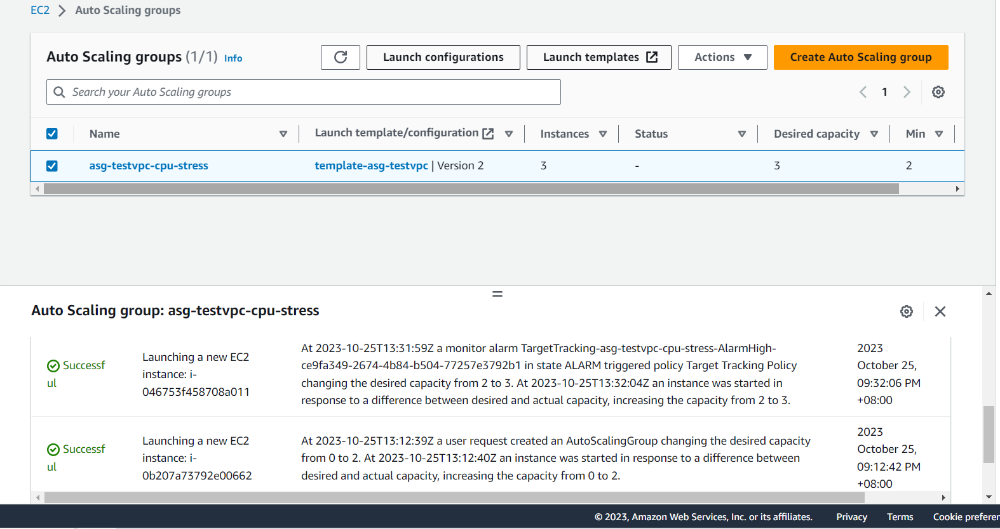
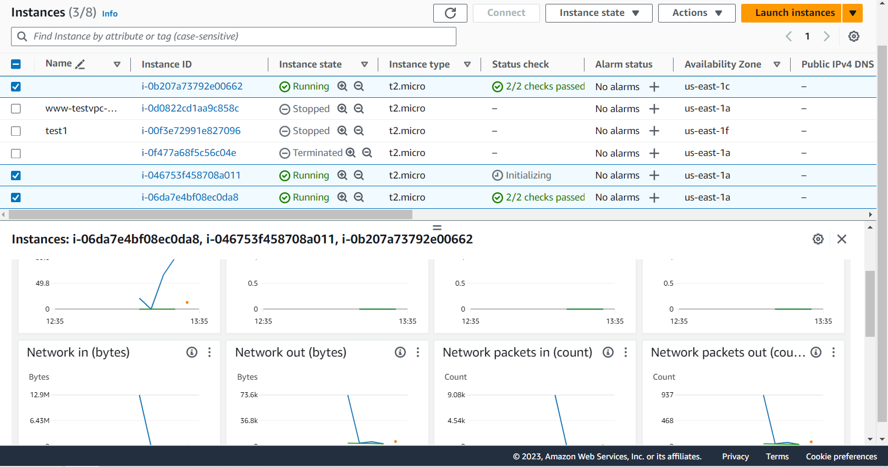
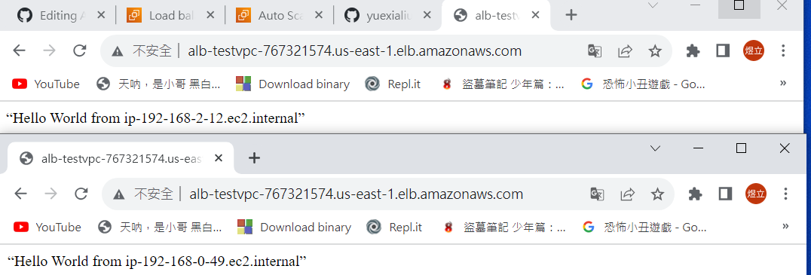

# 第六周
# Auto scaling Group(ASG)
* 自動擴張縮小雲端機器
* 客戶數量多時，有水平(horizontal)及垂直(vertical)兩種策略
  * 垂直策略:把本身機器效能往上提，只有一台伺服器。
  * 水平策略:從原本的一台伺服器，擴張成更多。

# Elastic load balance(ELB)
* 負載均衡器
* 2台虛擬機(public、public2)與ELB在一個target group裡，客戶端進來時，ELB會把客戶端分流到不同伺服器裡

# 實驗一 當有機器壞掉時，會自動生成新機器
> 創造Auto scaling group

```sh
選擇EC2
Auto scaling group
Cteate Auto scaling group
Name : asg-testvpc
Create a launch template
```
```sh
Launch template name:template-asg-testvpc
Quick Start : Amazon Linux
Instance type : t2.micro
Key pair : testkey
Create security group
Security group name :sg_asg_testvpc_http
Description : sg_asg_testvpc_http 
VPC : testvpc
Add security group rule
Type : HTTP
Source type : Anywhere
Advanced details
```
```sh
User Data:
#!/bin/bash
yum update -y
yum install -y httpd.x86_64
systemctl start httpd.service
systemctl enable httpd.service
echo “Hello World from $(hostname -f)” > /var/www/html/index.html

Create launch template
```
```sh
回到Create Auto Scaling group頁面
Launch template
重新整理
選擇template-asg-testvpc
Next
```
```sh
Network
VPC: 選擇testvpc
Availability Zones and subnets
勾選1a跟1c
Next
頁面先不動
Next
```
```sh
Desired capacity : 2
Minimum capacity : 2
Maximum capacity : 4
然後一直按Next
Create Auto Scaling group
創建成功
```
>測試能否自動生成

```sh
切換到Instance
測試1a與1c伺服器能否在網頁開啟
把1c伺服器Terminate
到Auto Scaling groups觀察Activity變化
Instance重新生成一個新機器
```
* 成功生成


# 實驗二 自動擴增伺服器
> 修改sg增加ssh

```sh
EC2
Launch Templates
勾選剛剛創建的template
Actions
Modify template (Create new version)
Network settings
選擇Create security group
Security group name : sg_asg_testvpc_http_ssh
Description : sg_asg_testvpc_http_ssh
VPC : 選擇testvpc
Add security group rule
增加HTTP與ssh rules
Source type 皆是Anywhere
Create template version
```
>創建Auto Scaling Group

```sh
回到Auto Scaling Groups
刪除剛剛建立的asg-testsvpc
點擊Create Auto Scaling group
Name : asg-testvpc-cpu-stress
Launch template
選擇template-asg-testvpc
Version : 選擇2
確認Security group是否選擇的是剛剛創建的
Next

VPC : 選擇testvpc
Availability Zones and subnets : 選擇1a跟1c
Next
此頁面不動，繼續Next

Desired capacity : 2
Minimum capacity : 2
Maximum capacity : 4
選擇Target tracking scaling policy
Target value :70
Next
Next
Next
Create Auto Scaling group
創建完成
```
>利用虛擬機測試壓力

```sh
打開虛擬機
連線至欲測試的機器裡
ssh -i testkey.pem ec2-user@54.173.48.248
sudo yum install stress -y
sudo stress --cpu 4
等待5分鐘，檢查虛擬機數量是否從2變成3(可用Monitoring觀察CPU負載)
成功開啟第3台虛擬機
```


* 做完記得把asg刪除

# 實驗三 2個客戶端進入時，把流量分向不同伺服器

> 產生2台ec2

```sh
Launch instance
Name : 分別打www1 、 www2
key pair : testkey
Network settings
VPC : testvpc
Subnet : 分別選擇testvpc-public 、 testvpc-public2
Select existing security group
選擇sg_asg_testvpc_http

User data:
#!/bin/bash
yum update -y
yum install -y httpd.x86_64
systemctl start httpd.service
systemctl enable httpd.service
echo “Hello World from $(hostname -f)” > /var/www/html/index.html

Launch instance
2台機器創建完成
```
> 產生Target groups

```sh
切換到Target groups
Create target group
選擇Instances
Target group name : tg-testvpc
VPC : 選擇testvpc > HTTP1
Next

勾選www1與www2
按下Include as pending below
Create target group
target group創建完成
```
> 創建ELB

```sh
切換Load Balancers
Create load balancer
創建Application Load Balancer的 > Create
Load balancer name : alb-testvpc
VPC : testvpc
勾選1a跟1c
Security groups : 選擇sg_asg_testvpc_http_ssh
Listeners and routing
Default action : 選擇tg-testvpc
Create load balancer
創建成功
```
> 連到網頁上，測試是否會換IP

```sh
等待alb-testvpc狀態變成Active
查看alb-testvpc的DNS name
複製alb-testvpc-767321574.us-east-1.elb.amazonaws.com(DNS name)
到瀏覽器上開啟
按重新整理
測試完成
```

