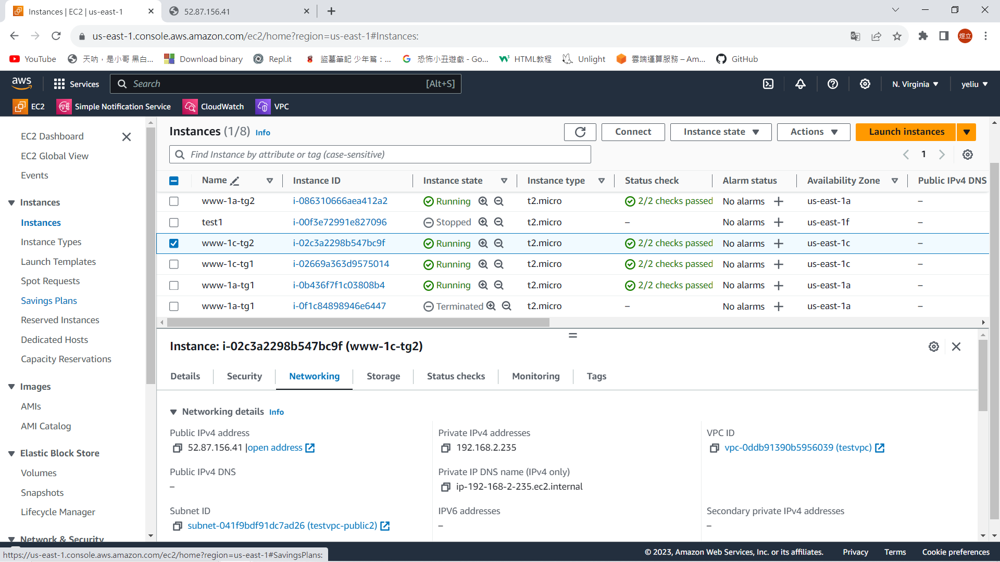

# 第七周
# 商業型網站架構
* 在region裡用EC2架網頁伺服器
* 把EC2放在不同的AZ裡(可做附載均衡、容錯)
* 再用一台EC2做DB
* 可把網頁伺服器的EC2做成target group，再用ELB平衡
* 可用ELB根據不同瀏覽器分流到不同伺服器上
# Serverless(沒有伺服器的服務)
* RDS(relational database service 關係型資料庫服務)
* 開啟就能用，不用安裝
* 有bug時Amazon會自動更新
# ELB分配
* 可直接設置百分比分配(50%/50%)
* 可根據不同瀏覽器分配(User-agent)
* 可根據關鍵字分配(key=value)
# 設置2個Target group分配流量
> 架設4台EC2

```sh
Launch instances
Name : www-1a-tg1 / www-1c-tg1 / www-1a-tg2 / www-1c-tg2
keypair可選可不選
Network settings
VPC : testvpc
Subnet : 名稱為1a選擇testvpc-public ， 名稱為1c選擇testvpc-public2
Select existing security group
都是選sg_testvpc_ssh_http
User data:

#!/bin/bash

########################################
##### USE THIS WITH AMAZON LINUX 2 #####
########################################

# get admin privileges
sudo su

# install httpd (Linux 2 version)
yum update -y
yum install -y httpd.x86_64
systemctl start httpd.service
systemctl enable httpd.service
echo "Hello World from $(hostname -f)" > /var/www/html/index.html
```
在User data 最後一行加上名字以便識別:echo "Hello World from $(hostname -f) TG1 1a" > /var/www/html/index.html
* 完成圖

