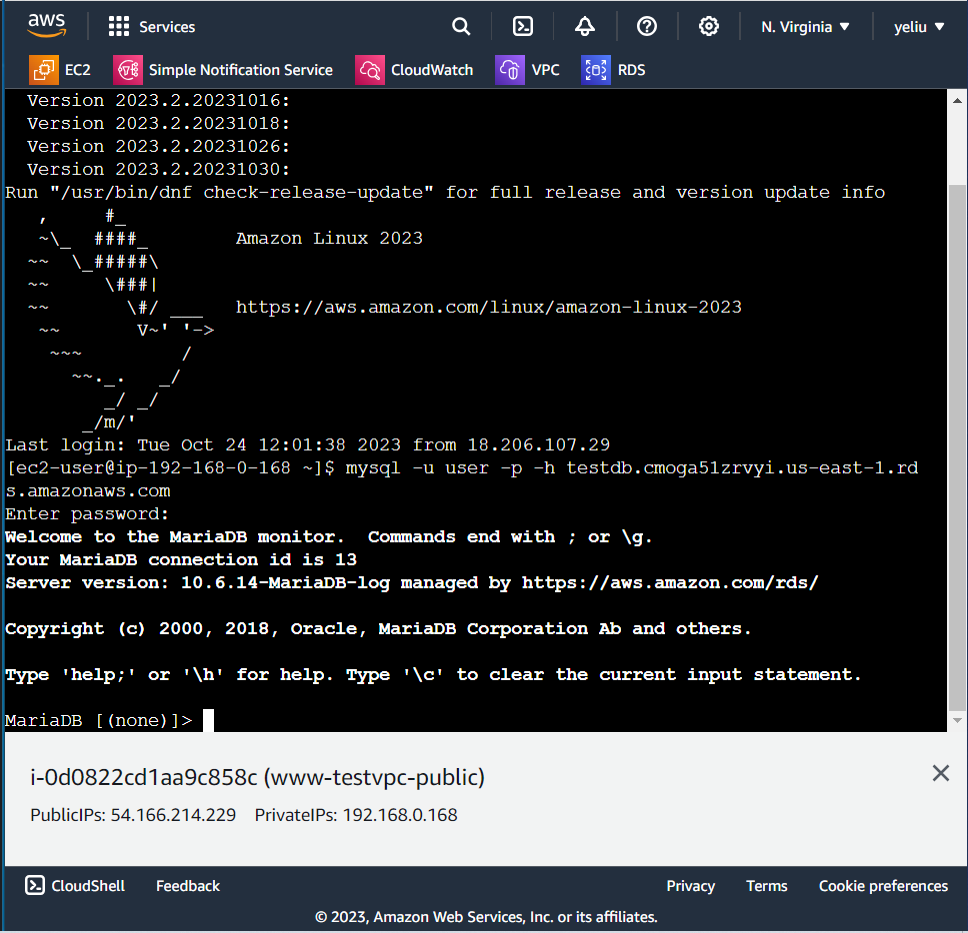
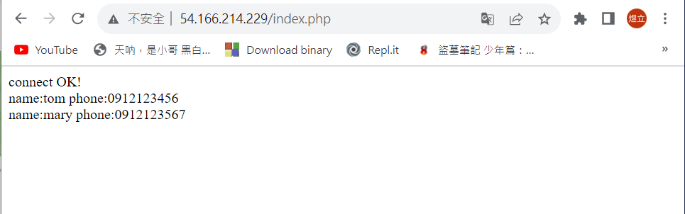
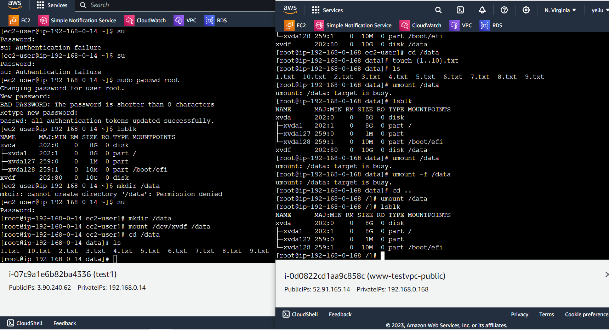

# 第九周
# Serverless service
* 不須架設伺服器即可使用
* RDS(relational database service)
  * 關係型資料庫
  * 不用自己維護
  * 可以直接用，AWS會幫忙更新、維護
  * 提供MySQL、Mariadb、Aurora等等資料庫
* EBS (Ebstic block store)
  * 虛擬機資料永久儲存
  * 電腦即使刪除，資料也仍會保留
* EFS(Ebstic Flies system)
  * 多個虛擬機共享資料
  * 在一台虛擬機寫上內容，另一台虛擬機也能看到
* EIP(Ebstic IP)
  * 彈性IP
  * 可申請一個固定IP地址，使虛擬機每次開關機時IP都能一樣
# RDS
> 創建資料庫
```sh
到RDS頁面
Dashboard
Create database
選擇Standard create
選擇MariaDB
Available versions預設MariaDB 10.6.14就行
Templates選擇Free tier
(Production可提供許多副本，把資料同步在不同機器上，效能更好，適合商用)
DB instance identifier : testDB
Master username : user
Master password / Confirm master password : 123456
Virtual private cloud (VPC) : testvpc
Existing VPC security groups : sg_testvpc_private_ssh_mysql
Availability Zone : us-east-1b
Create database
等待資料庫建立完成(約5分鐘)
Status > Backing-up
建立完成
```
> 登錄資料庫
```sh
啟動www-testvpc網頁伺服器
開啟www-testvpc網頁伺服器
點擊剛剛創建的資料庫，找到Endpoint，複製下面的網址
返回剛剛開啟的網頁伺服器頁面
mysql -u user -p -h (Endpoint，複製下面的網址)
密碼12345678
成功連線
```

 
> 增加資料
```sh
create database testdb;
use testdb;
create table addrbook(name varchar(50) not null, phone char(10));
insert into addrbook(name, phone) values ("tom", "0912123456");
insert into addrbook(name, phone) values ("mary", "0912123567");
select name,phone from addrbook;
```
> 在網頁上顯示資料
```sh
cd /var/www/html
vim testrds.php

<?php
$servername="testdb.ciwmmmyxlgti.us-east-1.rds.amazonaws.com";(改成自己的網址)
$username="user";    
$password="12345678";
$dbname="testdb";

$conn = new mysqli($servername, $username, $password, $dbname);

if($conn->connect_error){
    die("connection failed: " . $conn->connect_error);
}
else{
    echo "connect OK!" . "<br>";
}

$sql="select name,phone from addrbook";
$result=$conn->query($sql);

if($result->num_rows>0){
    while($row=$result->fetch_assoc()){
        echo "name: " . $row["name"] . "\tphone: " . $row["phone"] . "<br>";
    }
} else {
    echo "0 record";
}
?>

ESC
:wq
到網址列輸入http://ip+檔案名
完成
```


> 刪除RDS
```sh
勾選testdb
Actions
Delete
取消勾選Create final snapshot、Retain automated backups
勾選I acknowledge that upon instance deletion,automated backups,including system snapshots and point-in-time revovery,will  no longer be availble
輸入delete me 
Delete
```
# EBS
> 創建EBS
```sh
到EC2頁面
Elastic Block Store
Volumes
Create volume
Size (GiB) : 10
Availability Zone : us-east-1a(綁定可用區，只有1a能用)
Add tag
Key : name
Value : testEBS
Create volume
創建成功
```

>讓EBS與虛擬機連接上
```sh
勾選testEBS
Action
Attach volume
Instance : 選擇www-testvpc-public
Attach volume
```

>虛擬機儲存資料到EBS硬碟裡
```sh
開啟www-testvpc-public虛擬機
su切換為超級使用者
lsblk
/*  查看是否有成功attach，xvdf  */
file -s /dev/xvdf
/*  儲存資料用  */
mkfs -t xfs /dev/xvdf
/*  格式化硬碟  */
yum install xfsprogs
mkdir /data
mount /dev/xvdf /data
lsblk
cd /data
touch {1..10}.txt
ls
cd ..
umount /data
資料儲存成功
```

> 把硬碟拔除
```sh
到Volumes頁面
勾選testEBS
Actions
Force detach volume
輸入detach
Force detach
```

> 把硬碟插入另一虛擬機
```sh
創建一個新的EC2
Instance
Launch instances
Name : test1
Key pair name : testkey
VPC : testvpc
Subnet : testvpc-public
Select existing security group
Common security groups : sg_testvpc_ssh_http
Launch instance

勾選testEBS
Action
Attach volume
Instance : 選擇test1
Attach volume

開啟虛擬機
sudo passwd root
su
lsblk
mkdir /data
mount /dev/xvdf /data
cd /data
ls
資料成功轉移
```


> 刪除Volumes
```sh
勾選testEBS
Actioins
Detach Volumes
Delete Volumes
刪除EC2 test1
```
# Spot Requests
* 提出預算，與他人競爭閒置資源
* 不一定每次都能成功

# Dedicated Hosts
* 在專屬機器上運行虛擬機
* 有規定網路運行速度、記憶體大小等等
* 效能最好
* 價格最高

# Savings Plans
* 大量採購
* 先與AWS談好未來半年或一年所需用到的資源，用大量採購的方式壓低金額

# Elastic IPs使用
> 創建Elastic IPs
```sh
EC2
Elastic IPs
Allocate Elastic IP address
Network Border Group : us-east-1
Allocate

勾選剛剛創建的Elastic IPs
Actions
Associate Elastic IPs address
選擇Instance
Instance : www-testvpc-public
Associate
EC2 ip成功變成 Elastic IPs
```
