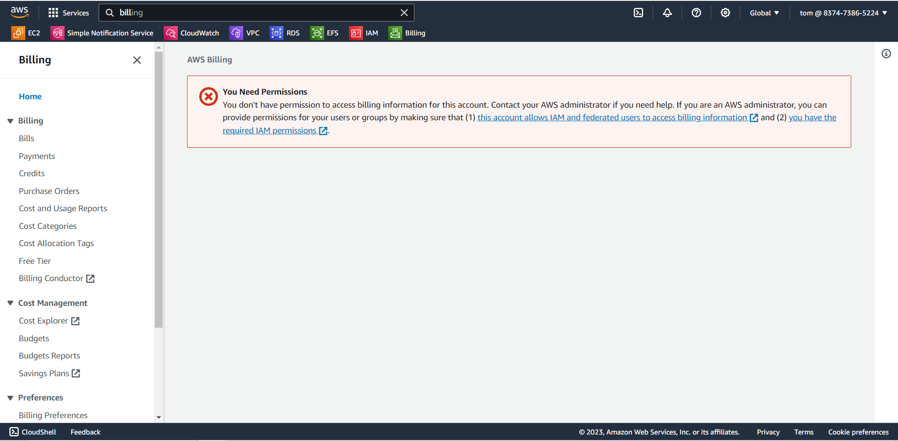
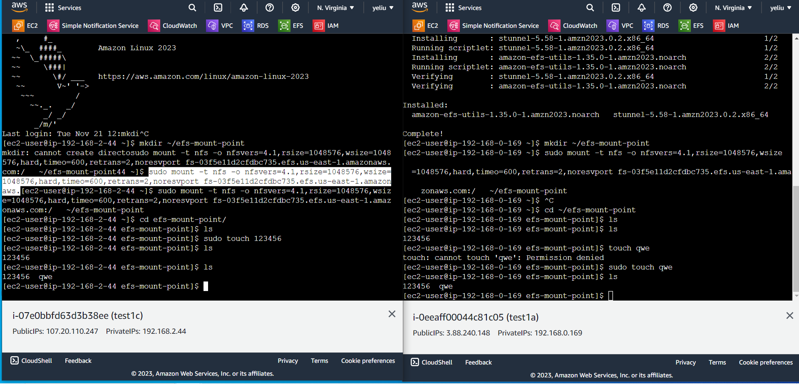

# 第十周
# EFS(Elastic File System)
* 可掛載2台不同EC2，共享相同的儲存環境
* EC2可在不同可用區
# IAM(Identity and Access Management)
* 身分跟存取的管理系統
* 全球性的
* 可針對User跟Group分類
* 一個使用者可以同時擁有多個不同群組
* 根據使用者不同，授予不同權限
* 用json格式描述權限
* 只會做哪些事，只要給對應的權限就好，其他不用開，避免操作錯誤
* 可繼承權限:當User在不同群組時，可同時擁有多個權限(多個群組相加)
> 創建使用者
```sh
到IAM頁面
Users
Create user
User name : tom
勾選Provide user access to the AWS Management Console
User type勾選I want to create an IAM user
Custom password : Tom1234!
取消勾選: Users must create a new password at next sign-in
Next
選擇Attach policies directly
Permissions policies勾選AdministratorAccess
Next
Create user
創建成功
```
> 登入使用者帳戶
```sh
到IAM的Dashboard，複製左邊的Sign-in URL for IAM users in this account網址
把網址貼到網址列上
輸入帳號密碼，登入
登入成功，到Billing頁面查看
```


# 使用EFS
> 修改vpc設置
```sh
到vpc頁面
Your VPC
點進testvpc
Edit VPC settings
勾選Enable DNS hostnames
Save
修改完成
```

> 修改Security group，增加新規則
```sh
到Security groupu頁面
選擇一個有ssh跟http的功能的sg
Edit inbound rules
增加新規則:NFS
```

>創建EFS
```sh
到EFS頁面
Create file system
Name: testEFS
VPC : testvpc
Create

切換到Access points
Create access point
File System選擇testEFS
Create access point
```
>修改EFS
```sh
進入testEFS
Network
Manage
把3個區域(1a1b1c)的security group選擇剛剛修改有NFS的sg
```

> 創建2台EC2
```sh
Name: test1a / test1c
key pair:testkey
VPC : testvpc
subnet public / public2
Select existing security group： 選擇剛剛修改的sg
Launch instances
創建完成
```

> EFS功能實用
https://docs.aws.amazon.com/zh_tw/efs/latest/ug/wt1-test.html
```sh
開啟剛剛創建的2台EC2
(2台都要)sudo yum install -y amazon-efs-utils
(2台都要)mkdir ~/efs-mount-point
(2台都要) sudo mount -t nfs -o nfsvers=4.1,rsize=1048576,wsize=1048576,hard,timeo=600,retrans=2,noresvport mount-target-DNS:/   ~/efs-mount-point
其中mount-target-DNS刪除，改成自己的EFS DNS name
(EFS DNS name在testEFS裡，DNS name)
(2台都要)cd efs-mount-point/
ls查看目前檔案
1台ec2新增檔案sudo touch 12345
到另一台ec2查看 ls
共享成功
```

