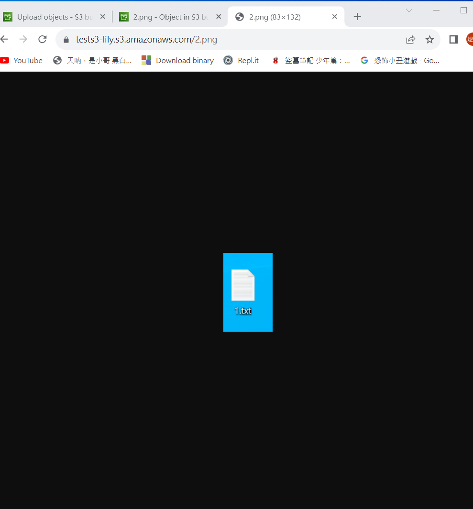
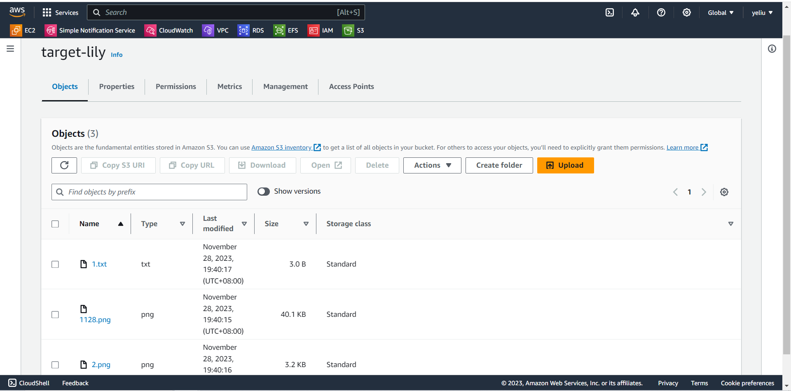
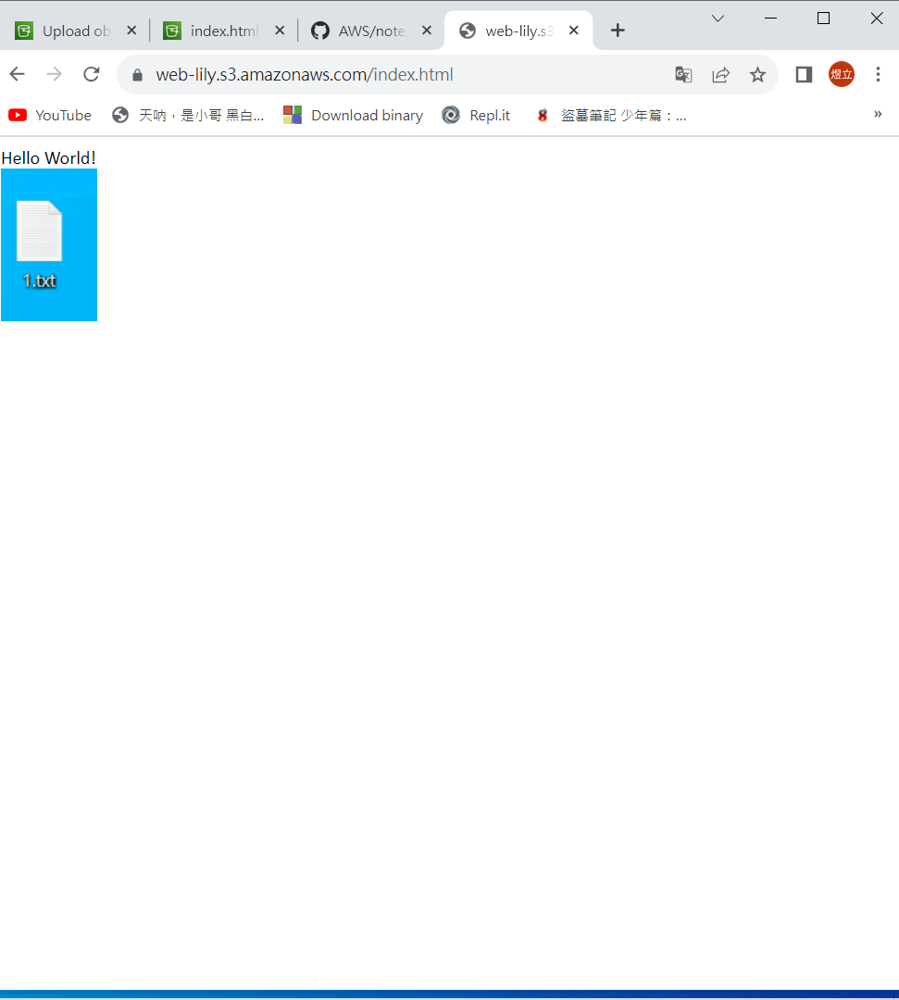
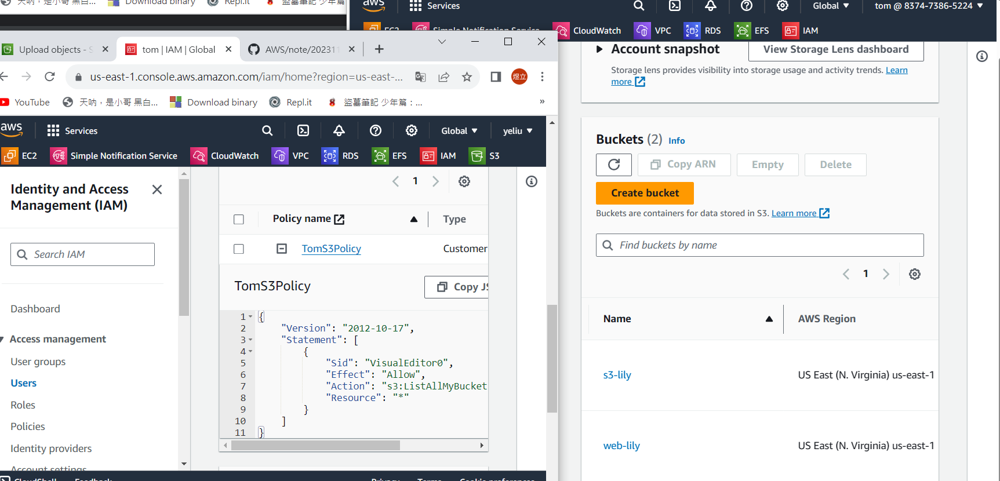
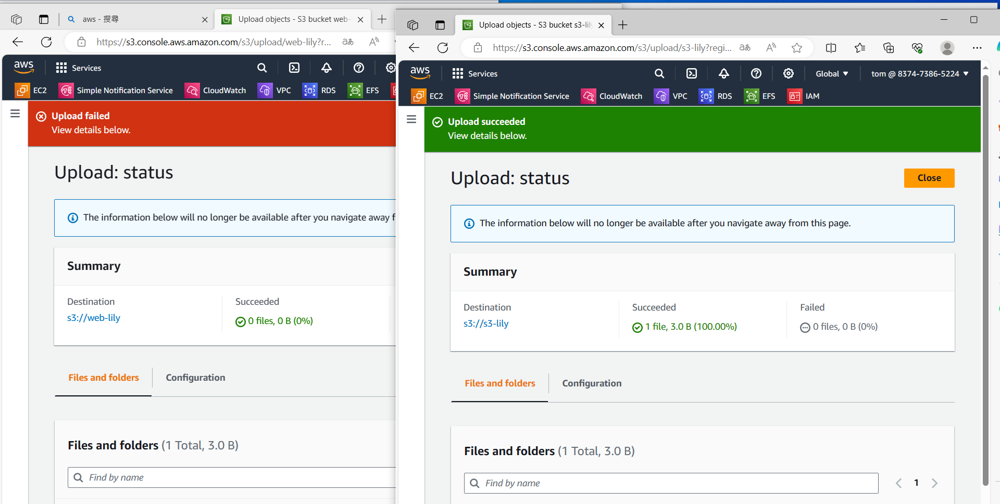
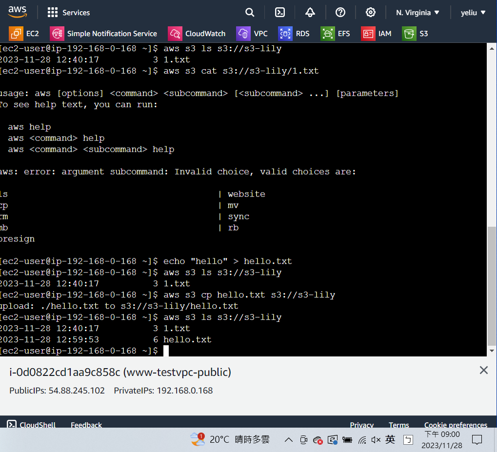

# 第十一周
# S3(Simple Storage Service)--Buckets
* 儲存檔案的地方
* 全球性
* 儲存桶名字是全球唯一的
# Buckets權限
* bucket policy
   * 以桶子為中心，設定某人可以進行什麼操作
* IAM
   * 針對某人設定權限，主體為人
* ACL(Access Control List)
# 使用Buckets功能
> 建立Buckets
```sh
切換到S3頁面
Buckets
Create bucket
Bucket name: tests3-lily
AWS Region : US East (N. Virginia) us-east-1
Block Public Access settings for this bucket勾選Block all public access
Bucket Versioning勾選Disable
Create bucket
```

> 查看已上傳檔案
```sh
點進剛剛創建的tests3-lily
Upload
上傳創建的1.txt及2.png檔案
Upload
點進1.txt
可點擊上方Open查看，
```

> 讓檔案公開存取
```sh
點進tests3-lily存取桶
Permissions
Block public access (bucket settings) Edit
取消所有打勾
Save
Permissions
Bucket policy
Edit

{
    "Version": "2012-10-17",
    "Statement": [
        {
            "Sid": "PublicReadGetObject",
            "Effect": "Allow",
            "Principal": "*",
            "Action": "s3:GetObject",
            "Resource": "arn:aws:s3:::blog.smallko.online/*"
        }
    ]
}

把arn:aws:s3:::blog.smallko.online改成自己上方的Bucket ARN
Save changes
此時已經可以用網址打開檔案
```


> 刪除Bucket
```sh
點選tests3-lily，Empty
輸入permanently delete
Empty
點選tests3-lily
Delete
輸入tests3-lily
Delete
刪除成功
```

> 查看檔案歷史更新
```sh
創建bucket
Create bucket
Bucket name: s3-lily
AWS Region : US East (N. Virginia) us-east-1
Block Public Access settings for this bucket勾選Block all public access
Bucket Versioning勾選Enable
Create bucket
打開1.txt檔，把裡面內容改為111
上傳s3-lily Bucket
打開1.txt檔，把裡面內容改為222
上傳s3-lily Bucket
打開1.txt檔，把裡面內容改為333
上傳s3-lily Bucket
點進s3-lily
打開Show versions
能看到剛剛上傳的3個版本
```

# 跨不同區域進行同步備份
> 創建2個Bucket
```sh
Create bucket
Bucket name: source-lily 、 target-lily
AWS Region : US East (N. Virginia) us-east-1 、 Asia Pacific (Tokyo) ap-northeast-1
Block Public Access settings for this bucket勾選Block all public access
Bucket Versioning勾選Enable
```

>連結2個bucket
```sh
點進source-lily
Management
Replication rules
Create replication rule
Replication rule name : S3CopyRule
Source bucket勾選Apply to all objects in the bucket
Destination
Bucket name
Browse S3選擇target-lily
IAM role選擇Choose from existing IAM roles
Save
選擇No,do not replicate existing object.
Submit
```

> 同步備份
```sh
點進source-lily
上傳3個檔案
等2分鐘
到target-lily東西是否同步
```


# 製作靜態網站
>創建word
```sh
開啟word
內容Hello World及任一張圖片
儲存成html模式:index.html
再開一個word
內容404 not found
儲存成html模式:404.html
```

>創建bucket
```sh
Create Bucket
Bucket name:web-lily
AWS Region : US East (N. Virginia) us-east-1 、 Asia Pacific (Tokyo) ap-northeast-1
Block Public Access settings for this bucket取消勾選Block all public access
勾選I acknowledge that the current settings might result in this bucket and the objects within becoming public.
Bucket Versioning勾選Disable
Create Bucketj;
把剛剛創建的網頁及其資料夾上傳
Bucket policy
Edit

{
    "Version": "2012-10-17",
    "Statement": [
        {
            "Sid": "PublicReadGetObject",
            "Effect": "Allow",
            "Principal": "*",
            "Action": "s3:GetObject",
            "Resource": "arn:aws:s3:::blog.smallko.online/*"
        }
    ]
}

把arn:aws:s3:::blog.smallko.online改成自己上方的Bucket ARN
Save changes
切換到Properties
最下方Static website hosting
Edit
Static website hosting勾選Enable
勾選Host a static website
Index document : index.html
Error document : 404.html
Save changes
點擊index.html
點擊它的Object URL
成功創建網頁
```


# 更改Tom看到bucket目錄的權限
> 登陸tom帳號
```sh
切換到IAM
複製Sign-in URL for IAM users in this account網址
在IE瀏覽器貼上網址
選擇IAM User
登陸tom帳號
密碼:tom1234!
tom到S3頁面，發現沒有權限
```

> 更改tom權限
```sh
GOOGLE瀏覽器:
IAM
User
點進tom
把Permissions policies 權限清空(Remove)
Add permissions
Create inline policy
Select a service選擇S3
List (15)
勾選ListAllMyBuckets
Resources勾選All
Next
Policy name:TomS3Policy
Create Policy
到IE瀏覽器重新整理頁面
tom可以看到S3內容了
```


# 更改Tom看到bucket的權限
```sh
點進tom
Permissions policies
Edit
點擊S3
勾選ListBucket 、 ListAllMyBuckets
Next
Save change
回到IE瀏覽器查看
```

> 增加Tom讀取bucket的權限
```sh
勾選GetObject
```

> 增加Tom上傳bucket的權限
```sh
勾選PutObject
```

> 讓Tom只能上傳一個bucket，另一個不行
```sh
複製程式碼，貼在下方並修改，讓程式碼呈現如下的狀態

{
	"Version": "2012-10-17",
	"Statement": [
		{
			"Sid": "VisualEditor0",
			"Effect": "Allow",
			"Action": [
				"s3:ListBucket",
				"s3:GetObject"
			],
			"Resource": "*"
		},
		{
			"Sid": "VisualEditor1",
			"Effect": "Allow",
			"Action": [
				"s3:ListAllMyBuckets",
				"s3:ListBucket",
				"s3:GetObject",
				"s3:PutObject"
			],
			"Resource": "arn:aws:s3:::s3-lily/*"
		}
	]
}

此時tom可在s3-lily裡上傳，另一個則會顯示上傳失敗
```


# 讓EC2可以複製(上傳)檔案到bucket
> 創建Roles
```sh
到IAM頁面
Roles
Create role
選擇AWS service
Use case
Service or use case選擇EC2
Next
Permissions policies 選擇AdministratorAccess
Next
Role name:EC2forS3Role
Create role
```

> 讓EC2與role連結
```sh
開啟ec2 www-testvpc
勾選www-testvpc
Actions
Security
Modify IAM role
IAM role
選擇EC2forS3Role
Update IAM role
```

> EC2上傳到bucket
```sh
進入虛擬機
aws s3 ls
aws s3 ls s3://s3-lily (s3-lily可任意更換名稱)
echo "hello" > hello.txt
aws s3 cp hello.txt s3://s3-lily
aws s3 ls s3://s3-lily
上傳完成
```

