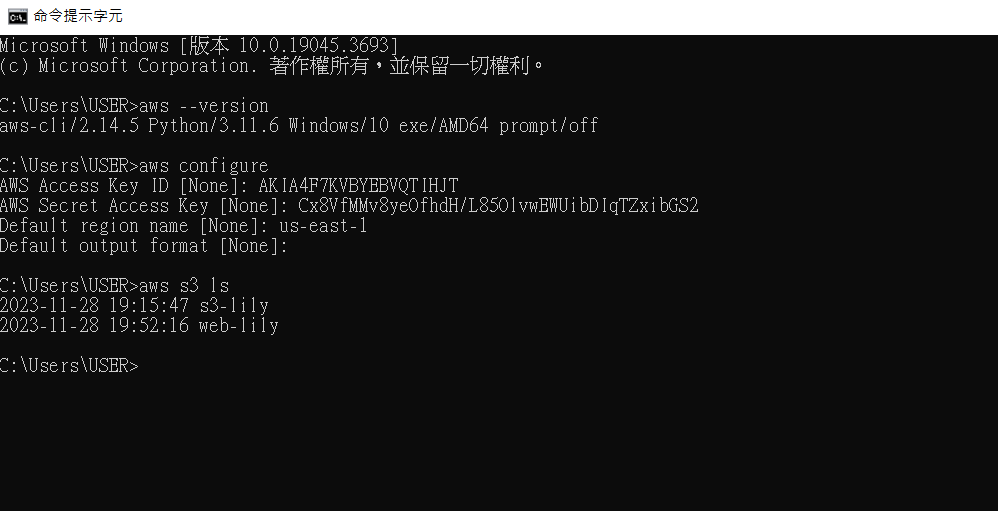
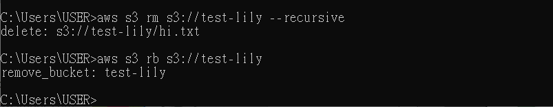

# 第十二周
# AWS CLI
* 安裝 AWS CLI

安裝教學:https://docs.aws.amazon.com/zh_tw/cli/latest/userguide/getting-started-install.html
* 完成圖

* 使用金鑰登陸

使用教學:https://blog.gtwang.org/linux/linux-aws-command-upload-download-s3-file-tutorial-examples/#google_vignette
* 刪除Bucket

