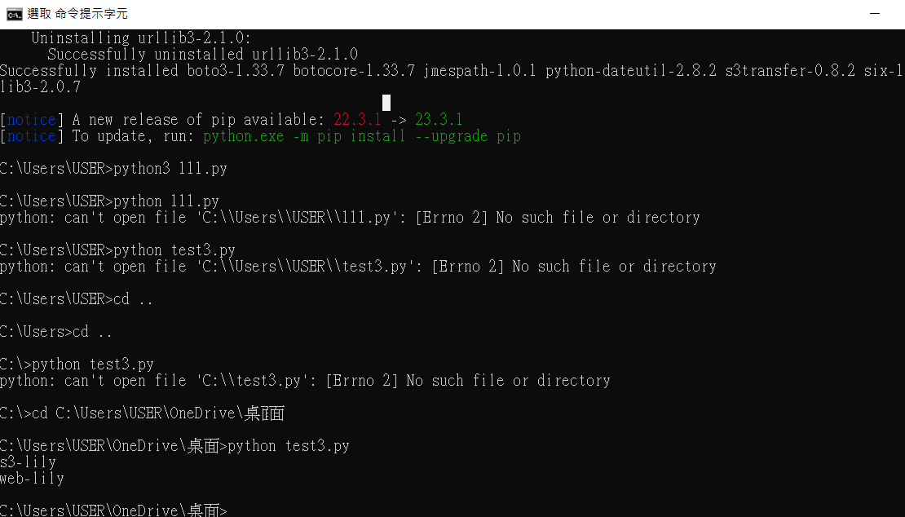
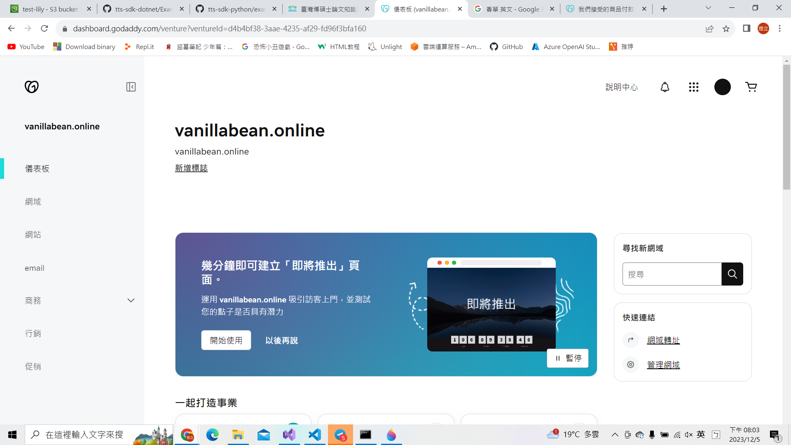
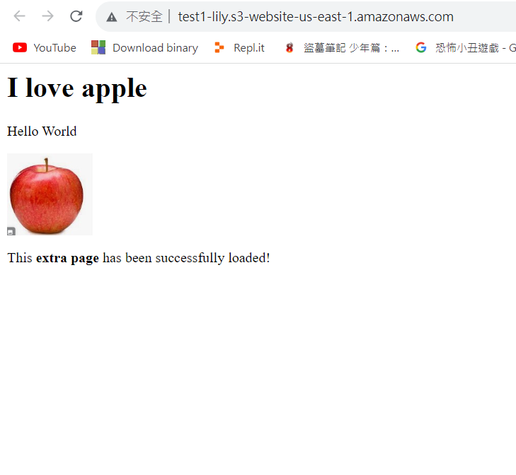
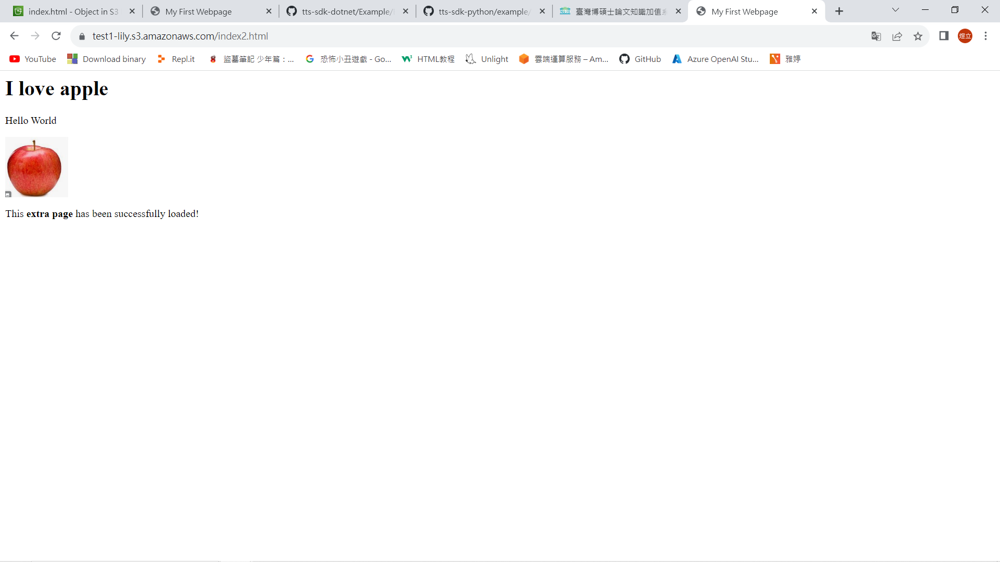

# 第十二周
# AWS CLI
* 安裝 AWS CLI
安裝教學:https://docs.aws.amazon.com/zh_tw/cli/latest/userguide/getting-started-install.html
* 完成圖


* 使用金鑰登陸
> 更改tom權限
```sh
到IAM頁面
User
進入tom
Permissions policies 
刪除現有權限
Add permissions
選擇Attach policies directly
勾選AdministratorAccess
Next
Add permissions
```
> 生成金鑰
```sh
Access key 1
Create access key
選擇Command Line Interface (CLI)
勾選I understand the above recommendation and want to proceed to create an access key.
Next
Create access key
記住生成的金鑰，到cmd裡輸入
aws configure
貼上Access key ID 、 Secret Access key
Default refion name : us-east-1
Default output format:直接按Enter
aws s3 ls
成功登錄
```


> Cli使用教學

使用教學:https://blog.gtwang.org/linux/linux-aws-command-upload-download-s3-file-tutorial-examples/#google_vignette

> 建立Bucket
```sh
aws s3 mb s3://test-lily
```
> 查看Bucket
```sh
aws s3 ls
```
> 複製檔案並上傳
```sh
aws s3 cp hi.txt s3://test-lily
```
> 上傳目錄
```
建立目錄及檔案
mkdir testdir
cd testdir
touch {a..d}.txt
cd ..
上傳目錄
aws s3 cp  testdir s3://test-lily --recursive
```
> 查看檔案
```sh
aws s3 ls s3://test-lily
```
> 從雲端下載檔案
```sh
aws s3 cp s3://test-lily/a.txt .
```
> 刪除Bucket
```sh
aws s3 rm s3://test-lily --recursive
aws s3 rb s3://test-lily
```


# 使用boto3
> 安裝python3.7以上版本及boto3
```sh
pip3 install boto3
``` 
> 建立一個txt檔，輸入以下內容，然後儲存成py

```sh
import boto3

s3 = boto3.resource("s3")

# 获得所有的 bucket, boto 会自动处理 API 的翻页等信息。
for bucket in s3.buckets.all():
    print(bucket.name)

儲存成test3.py
到cmd輸入:
python test3.py
```


# 註冊Domain name
> 買一個網域
```sh
https://tw.godaddy.com/whois?isc=twdomgoe1&countryview=1&currencyType=TWD&cdtl=c_20726757311.g_155456413175.k_aud-718109900613:dsa-2163013564243.a_678875414083.d_c.ctv_g&bnb=nb&gad_source=1&gclid=CjwKCAiAvdCrBhBREiwAX6-6UtlADYf7R3tphoPgAOJc4kWFFDaIkTtGWPE-SuQJoGCzQqWqnhJlchoChmIQAvD_BwE
```


> 建立託管區域
```sh
到Route 53頁面
Create hosted zone
Domain name : vanillabean.online
選擇Public hosted zone
Create hosted zone

到godaddy買的網域頁面
網域
管理 DNS
名稱伺服器
變更名稱伺服器
勾選我要用自己的名稱伺服器
點進剛剛在Route 53裡創建的vanillabean.online
把Value/Route traffic to的網址全部加在godaddy網域裡
```
> 測試網域
```sh
打開cmd
nslookup test.vanillabean.online
```

# CORS (cross-origin resource sharing)
* 跨不同網站共享
* 文字在a網站，圖片在b網站
* 使用CORS
> 建立2個Bucket
```sh
到s3頁面
Create bucket
Bucket name : test1-lily / test2-lily
取消勾選Block all public access
勾選I acknowledge that the current settings might result in this bucket and the objects within becoming public.
Create bucke
```

> 更改2個Bucket主頁
```sh
點進test1-lily / test2-lily
Properties
Static website hosting
Edit
Static website hosting 選擇 Enable
Index document : index.html
Save changes
```
> 更改2個Bucket權限
```sh
點進test1-lily / test2-lily
Permissions
Bucket policy
Edit

{
	"Version": "2012-10-17",
	"Statement": [
		{
			"Sid": "PublicReadGetObject",
			"Effect": "Allow",
			"Principal": "*",
			"Action": "s3:GetObject",
			"Resource": "arn:aws:s3:::test1-lily/*"
		}
	]
}

記得把arn:aws:s3:::test1-lily改成自己的Bucket ARN
```
> 上傳網站
```sh
test1-lily頁面
上傳index.html 、 extra.html 、 apple.jpg
Properties
點擊Static website hosting網址
```


> 更改index2.html
```sh
打開index2.html
把fetch('https://test2-lily.s3.amazonaws.com/extra.html')改成自己的名稱

到test1.lily
上傳index2.html

到test2-lily
上傳extra.html
Permissions
Cross-origin resource sharing (CORS)
Edit
貼上
[
    {
        "AllowedHeaders": [
            "Authorization"
        ],
        "AllowedMethods": [
            "GET"
        ],
        "AllowedOrigins": [
            "http://test1-lily.s3-website-us-east-1.amazonaws.com"
        ],
        "ExposeHeaders": [],
        "MaxAgeSeconds": 3000
    }
]

把"http://test1-lily.s3-website-us-east-1.amazonaws.com"改成自己的test1-lily的Static website hosting網址
打開http://test1-lily.s3-website-us-east-1.amazonaws.com在後面加上/index2.html
http://test1-lily.s3-website-us-east-1.amazonaws.com/index2.html
```

