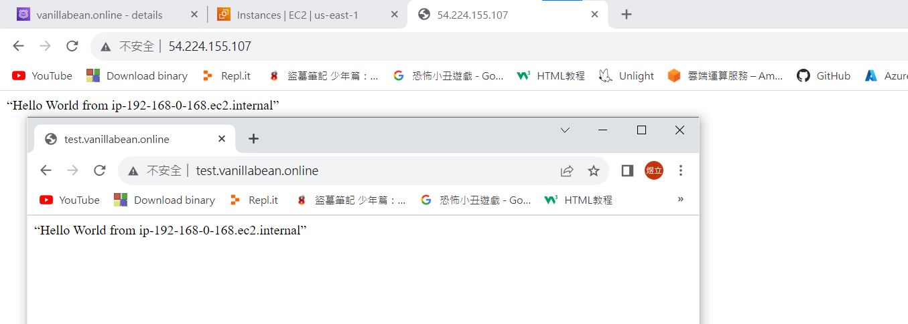

# 第十三周
# Route 53
* Record type:
* A : 前面給的domain name，value輸入的是IPv4位置
* AAAA : 前面給的domain name，value輸入的是IPv6位置
* CNAME : 除了原來的名稱外，另給一個別名
  * TTL : 放到cache中存放的時間，設定時間越密集，價格越高
## 在網址列中把ip變成domain name
> 更改Record設定
```sh
到EC2頁面
開啟www的虛擬機
複製Public IPv4 address
進入Route 53頁面
Hosted zones
點進上禮拜創建的vanillabean.online
勾選上禮拜創建的Record : test.vanillabean.online
Edit record
Value : 貼上複製的Public IPv4 address
Save
```
* 可使用ip或domain name去存取


## 增加C Name
> 增加新Record
```sh
Create record
Record name : test2
Record type : CNAME – Routes traffic to another domain name and to some AWS resourse
value : test.vanillabean.online
TTL : 120
Create records
到瀏覽器網址列輸入test2.vanillabean.online
```
* test.vanillabean.online與test2.vanillabean.online都是同一個網站，只是名稱不同

