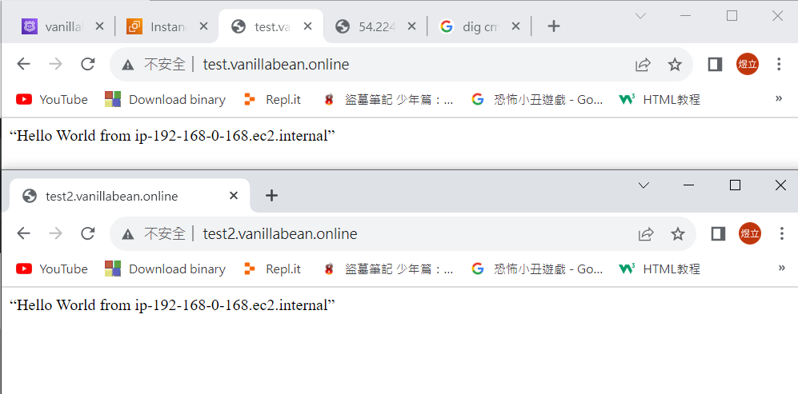
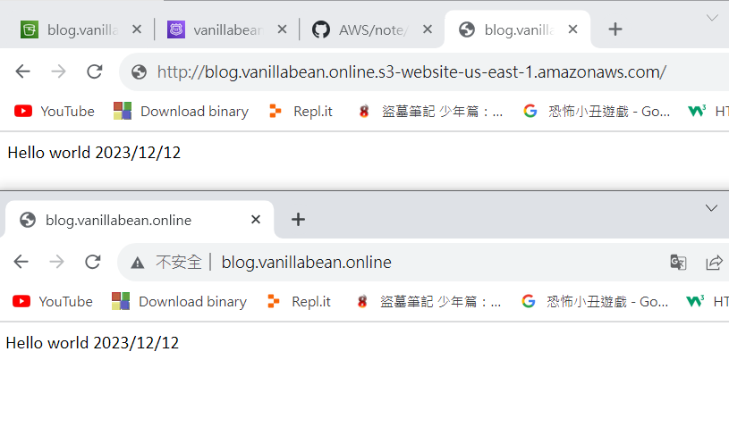

# 第十三周
# Route 53
* Record type:
* A : 前面給的domain name，value輸入的是IPv4位置
* AAAA : 前面給的domain name，value輸入的是IPv6位置
* CNAME : 除了原來的名稱外，另給一個別名
  * TTL : 放到cache中存放的時間，設定時間越密集，價格越高
## Domain Name與Alias差異
* Domain Name
  * 前面Sub domain不能是空的
* Alias的
  * AWS特有的
  * Sub domain可以是空的
## Routing policy
* Weighted : 附載均衡器
* Geolocation ： 根據所在位置，回答不同IP
* Latency : 選擇延遲的時間去回應IP
* Failover : 當伺服器回應出現問題，會自動找尋下一個伺服器去回應
* Multivalue answer : 一個Domain name可能會有多個值，從裡面隨機挑選
## 在網址列中把ip變成domain name
> 更改Record設定
```sh
到EC2頁面
開啟www的虛擬機
複製Public IPv4 address
進入Route 53頁面
Hosted zones
點進上禮拜創建的vanillabean.online
勾選上禮拜創建的Record : test.vanillabean.online
Edit record
Value : 貼上複製的Public IPv4 address
Save
```
* 可使用ip或domain name去存取


## 增加C Name
> 增加新Record
```sh
Create record
Record name : test2
Record type : CNAME – Routes traffic to another domain name and to some AWS resourse
value : test.vanillabean.online
TTL : 120
Create records
到瀏覽器網址列輸入test2.vanillabean.online
```
* test.vanillabean.online與test2.vanillabean.online都是同一個網站，只是名稱不同


## 把AWS提供的Domain name名稱變成自己喜歡的樣子
> 創建Bucket
```sh
到S3頁面
Create bucket
Bucket name : blog.vanillabean.online
*/Bucket name名稱需與Domain name名稱相同，不能亂取/*
取消勾選Block all public access
勾選I acknowledge that the current settings might result in this bucket and the objects within becoming public.
Create bucket
點進blog.vanillabean.online
Permissions
Bucket policy
Edit

{
	"Version": "2012-10-17",
	"Statement": [
		{
			"Sid": "PublicReadGetObject",
			"Effect": "Allow",
			"Principal": "*",
			"Action": "s3:GetObject",
			"Resource": "arn:aws:s3:::blog.vanillabean.online/*"
		}
	]
}

Save changes
Properties
Static website hosting
Edit
Static website hosting
選擇Enable
Index document : index.html
Save changes
創建一個word存取成html格式，存取名稱為index.html，上傳到blog.vanillabean.online
打開Static website hosting的網址
```
> 更改domain name 名稱
```sh
到Route 53頁面
Create record
Record name : blog
開啟Alias
Route traffic to
Alias to S3 website endpoint
US East (N. Virginia)
選擇剛剛創建的網址 : s3-website-us-east-1.amazonaws.com
Create records
到瀏覽器輸入blog.vanillabean.online
```


## 網頁分流，附載均衡器 --weighted
>創建一台ec2
```sh
準備2台有http及ssh功能的ec2
```
>創建2個record
```sh
到Route 53頁面
Create record
Record name : weighted
value :分別貼上2台EC2的Public ip
TTL : 60
Routing policy : Weighted
```
