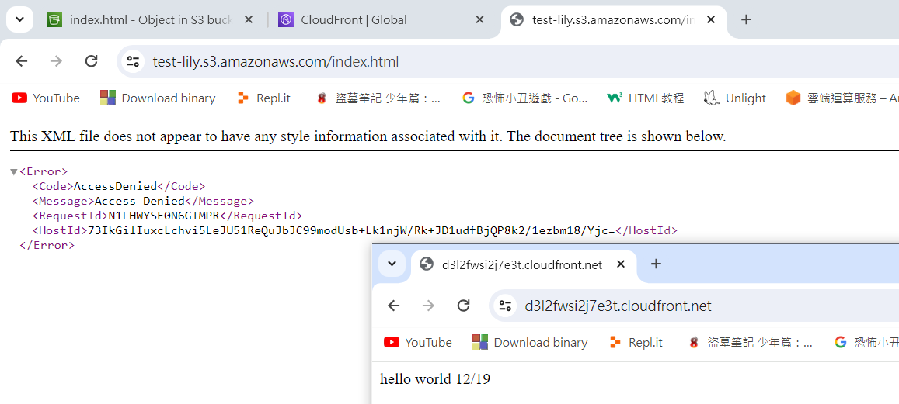
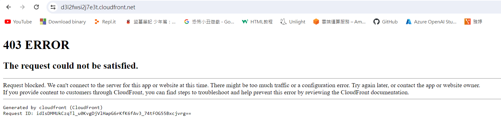
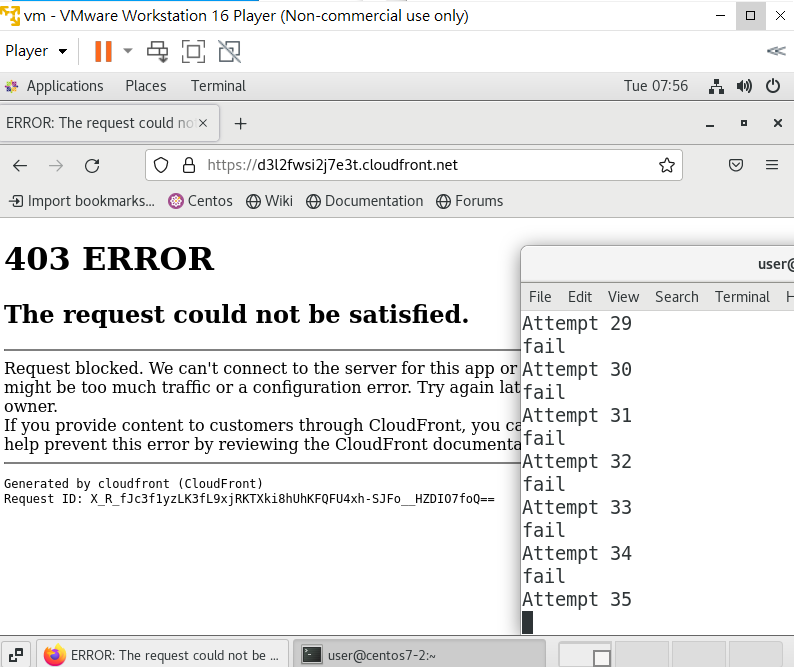
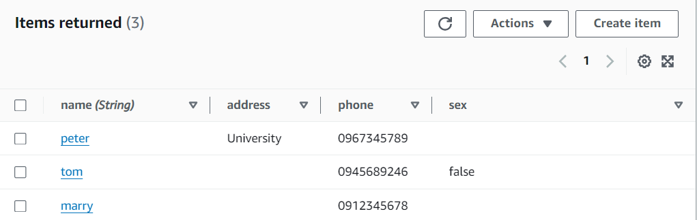
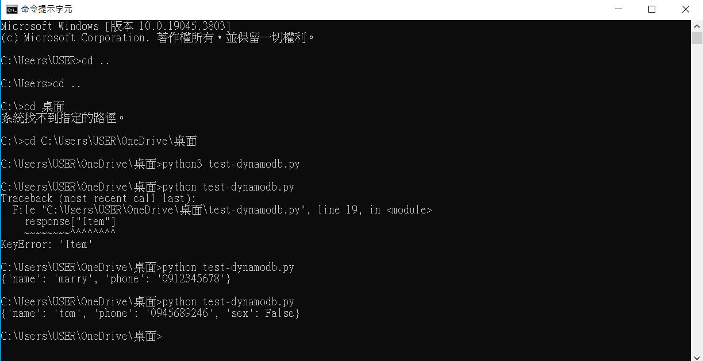

# 第十四周
# 透過cloudfront連接網頁
> 創建S3儲存桶
```sh
到S3頁面
Create bucket
Bucket name : test-lily
Create bucket
創建一個網頁，放進bucket裡
```
> 創建cloudfront
```sh
到cloudfront頁面
Create distribution
Origin domain : 選擇剛剛創建的test-lily.s3.us-east-1.amazonaws.com
Origin access :選擇Origin access control settings (recommended)
Create control setting
名字改成test-lily
Create
Web Application Firewall (WAF) 
Do not enable security protections
Settings
Default root object : index.html
Create distribution

點擊copy policy
回到s3頁面，進入剛剛創建的test-lily
Permissions
Bucket policy
Edit
貼上剛剛複製的policy
Save changes

回到cloudfront頁面，等待Last modified狀態從Deploying變成時間
複製cloudfront的Domain name在瀏覽器開啟
```


# 擋某個特定IP
> 建立被擋IP
```sh
在瀏覽器打myip，查詢自己的ip位置，複製
到WAF & Shield頁面
IP sets
Create IP set
IP set name : MyIPSet
Region :　Global (CloudFront)　(如果沒出現就先做下面建立web ACL的動作，做到選擇Ip Set再回來設置)
IP addresses : 貼上剛剛複製的IP位置，後面加/32
Create IP set
```

> 建立Web ACL
```sh
Web ACLs
Create web ACL
選擇Amazon CloudFront distributions
Name : MyWebACL
Associated AWS resources
Add AWS resources
勾選剛剛創建的cloudfront
Add
Next

Rules
Add rules
Add my own rules and rule groups
選擇IP set
Name: MyRule
IP set : 選擇MyIPSet
Add rule
Next
Next
Create web ACL

重新整理剛剛cloudfront的domain name網頁
```


# 擋惡意攻擊(五分鐘連線超過100次)
> 建立Web ACL
```sh
到WAF & Shield頁面
若有其他規則，先刪除(如剛剛擋ip的MyWebACL)
Web ACLs
Create web ACL
Create web ACL選擇Amazon CloudFront distributions
Name : MyWebACL
Associated AWS resources 
Add AWS resources
勾選剛剛創建的cloudfront
Add
Next

Rules
Add rules
Add my own rules and rule groups
選擇Rule builder
Name : MyRateBasedRule
選擇Rate-based rule
Rate-limiting criteria
Rate limit : 100
Add rule
Next
Next
Next
Create web ACL
```
> 建立能快速存取100次的腳本
```sh
開啟虛擬機
vim test.sh

for i in {1..110}
do
  echo "Attempt $i"
  result=$(curl -o /dev/null -s -w "%{http_code}" https://d36xl9iuaw2xue.cloudfront.net/)
  if [[ "$result" == "200" ]] ; then
    echo "ok"
  else
    echo "fail"
  fi
done

把"https://d36xl9iuaw2xue.cloudfront.net"改成自己的cloudfront網址
ESC
:wq
bash test.sh
執行bash test.sh指令，到他變成fail為止
```


# DynamoDB
* 非關係型資料庫，只有表格
> 建立表格
```sh
到DynamoDB頁面
Create table
Table name : addrbook
Partition key : name
Create table
```
> 建立資料
```sh
Explore items
選擇addrbook
Create item
name -- mary
Add new attribute
String
輸入 phone -- 0976836735
Create item
```


> 建立一個能抓取資料的python腳本test-dynamodb.py
```sh
import boto3
import os
os.environ['AWS_DEFAULT_REGION'] = 'us-east-1'


_TableName_ = "addrbook"

client = boto3.client('dynamodb')

DB = boto3.resource('dynamodb')
table = DB.Table(_TableName_)

response = table.get_item(
    Key={
        'name': "mary"
    }
)
response["Item"]

print(response['Item'])
```
> 執行py檔
```sh
aws configure
輸入之前存取的密鑰
aws s3 ls 查詢是否登入成功
python test-dynamodb.py
```


# Lambda function
* 用來做無伺服器運算使用，但不是真的沒有伺服器，只是不用管細緻的事情
* 不用管機器cpu、網路、記憶體等細節，只要寫好程式就好
> 產生Lambda function需要的Roles
```sh
到IAM頁面
Roles
Create role
Service or use case選擇Lambda
Next
Permissions policies選擇
AmazonDynamoDBFullAccess與AWSLambdaBasicExecutionRole2個權限
Next
Role name : LambdaRole
Create role
```
