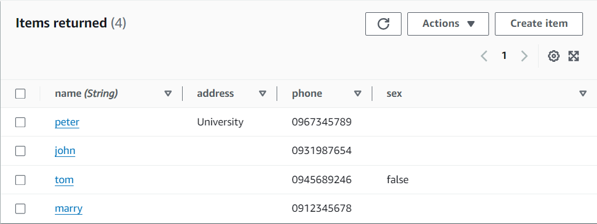

# 第十五周
# 讀取資料庫的資料
> 新增role權限
```sh
進入Identity and Access Management (IAM)頁面
Roles
點擊上禮拜創建的LambdaRole
Permissions policies
Add permissions
Attach policy
新增AWSLambdaSQSQueueExecutionRole與AWSLambdaVPCAccessExecutionRole權限
```
> 建立Lambda函式
```sh
進入AWS Lambda頁面
Functions
Create function
選擇Author from scratch
Function name : Lambda_getItems
Runtime選擇Python 3.12
Execution role選擇Use an existing role
選擇LambdaRole
Create function
```
> 貼上程式碼
```sh
點入Lambda_getItems
貼上程式碼

import json
import boto3

client = boto3.client('dynamodb')

def lambda_handler(event, context):
  data = client.get_item(
    TableName='addrbook',
    Key={
        'name': {
          'S': 'tom'
        }
    }
  )
  print(data['Item'])
  response = {
      'statusCode': 200,
      'body': json.dumps(data['Item']),
      'headers': {
        'Content-Type': 'application/json',
        'Access-Control-Allow-Origin': '*'
      },
  }
  return response

Deploy
Test
Event name:testEvent
Save
Test
即可看到Tom的資料
```


# 寫入資料庫的資料
> 建立Lambda函式
```sh
Functions
Create function
選擇Author from scratch
Function name : Lambda_writeItems
Runtime選擇Python 3.12
Execution role選擇Use an existing role
選擇LambdaRole
Create function
```
> 貼上程式碼
```sh
點入Lambda_writeItems
貼上程式碼

import json
import boto3
client = boto3.client('dynamodb')
def lambda_handler(event, context):
    PutItem = client.put_item(
        TableName='addrbook',
        Item={
            'name': {
              'S': 'john'
            },
            'phone': {
              'S': '0931987654'
            }
        }
      )
    response = {
      'statusCode': 200,
      'body': json.dumps(PutItem)
    }
    return response

Deploy
Test
Event name:testEvent
Save
Test
回到DynamoDB頁面，即可看到john被寫入資料庫
```


# 使用API抓取資料庫裡的資料
> 建立Lambda函式
```sh
Functions
Create function
選擇Author from scratch
Function name : Lambda_DynamoDB
Runtime選擇Python 3.12
Execution role選擇Use an existing role
選擇LambdaRole
Create function
```
> 貼上程式碼
```sh
點入Lambda_DynamoDB
貼上程式碼

import json
import boto3
import logging

logger = logging.getLogger()
logger.setLevel(logging.INFO)

dynamodb = boto3.resource('dynamodb',region_name='us-east-1')

def lambda_handler(event, context):
  print(event)
  data = {
    'Items' : "Bad Request"
  }
  statusCode = 200
  path = event["path"]
  httpMethod = event["httpMethod"]
  table = dynamodb.Table('addrbook')
  if httpMethod == 'GET' and path == '/addrbook':
    data = table.scan()
  elif httpMethod == 'POST' and path == '/add_addrbook':
    if event['body'] is not None :
      body = json.loads(event['body'])

      table.put_item(
        Item={
          'name': body['name'],
          'phone': body['phone']
        },
      )

      data = {
        'Items' : "addrbook created statusCodeuccessfully"
      }
    else:
      data = {
        'Items' : "Invalid Payload"
      }
      statusCode = 400
  else:
    statusCode = 400

  print(data['Items'])
  response = {
    'statusCode': statusCode,
    'body': json.dumps(data['Items']),
    'headers': {
       'Content-Type': 'application/json',
    },
  }

  return response
Deploy
```
> 建立API Gateway
```sh
進入API Gateway頁面
Create API
選擇REST API ，Bulid
選擇New API
API name : testAPI
Create API

進入testAPI
Create resource
Resource name : addrbook
Create resource

Create method
Method type : GET
開啟Lambda proxy integration
Lambda function : 選擇Lambda_DynamoDB
```
> 測試程式碼
```sh
點進GET
Test
Test
```


> 部署api
```sh
進入API Gateway頁面
testAPI
Resources
Deploy API
Stage 選擇 *New stage*
Stage name : test
Deploy

複製 Stage裡的 Invoke URL網址
開啟Google擴充功能 Tabbed Postman - REST Client
在Normal裡貼上網址，網址最後面加上/addrbook
選擇GET
點擊Headers
2個空格分別輸入Content-Type 、 application/json
Send
下方顯示資料庫資料
```


# 使用命令創建ec2虛擬機
> 下載terraform
```sh
https://www.terraform.io/
```
> 創建2個tf檔案
```sh
mkdir test_terraform
cd test_terraform
mkdir projectl
cd projectl
gedit main.tf

provider "aws" {
  region = var.region
}

resource "aws_instance" "mytest_vm" {
  ami = lookup(var.amis, var.region)
  instance_type=var.instance_type
  
  tags = {
   # Name = "mytest",
 }
}

ESC
:wq
到ec2頁面
AMI Catalog
複製旁邊的ami
gedit variables.tf

variable "region" {
    type = string
    default = "us-east-1"
    description="aws region"
}

variable "amis" {
    type=map
    default = {
        us-east-1 = "ami-079db87dc4c10ac91"
    }
    description = "ami id"

}

variable "instance_type" {
    type=string
    default = "t2.micro"
    description = "EC2 instance type"
}

ESC
:wq
(記得更改us-east-1 = "ami-079db87dc4c10ac91"後面的ami值為複製的ami)

```
