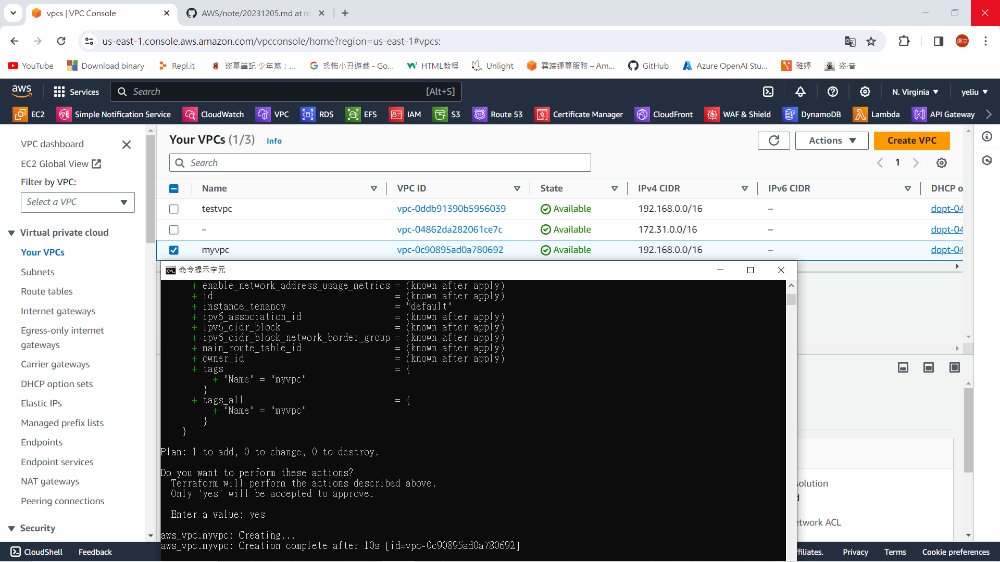
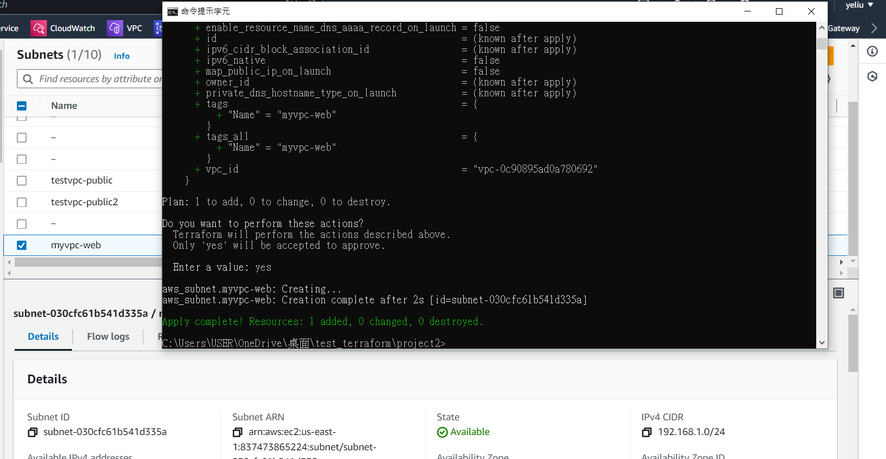
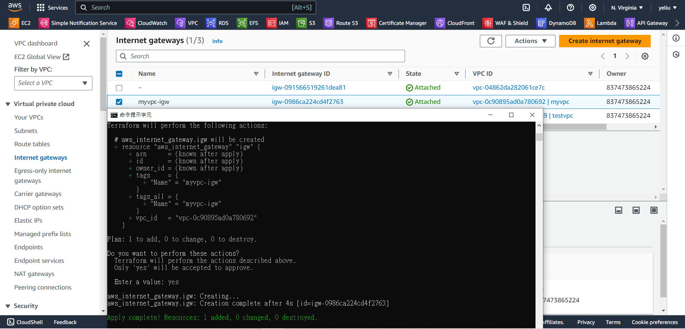
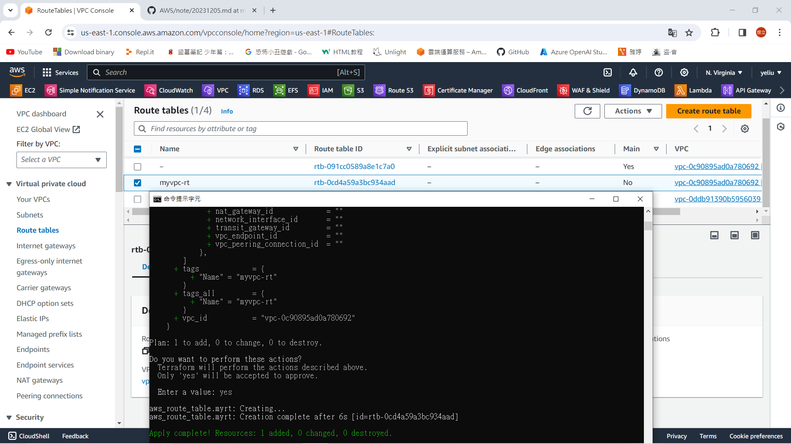
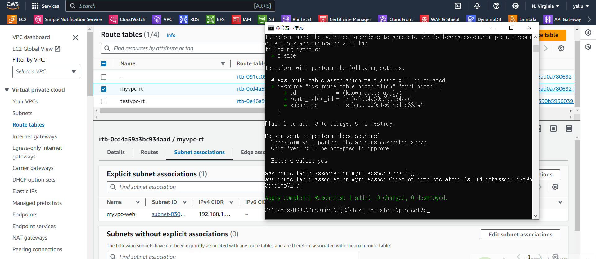
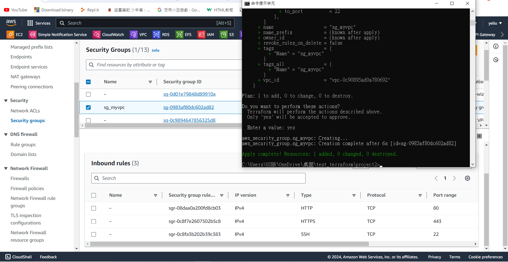
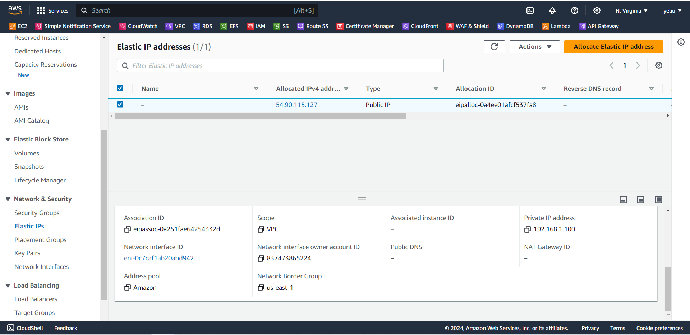

# 第十六周
# 用程式碼做出一個完整的虛擬機+網頁
程式碼網頁:https://registry.terraform.io/providers/hashicorp/aws/latest/docs/resources/instance
> 建立vpc
```sh
在test_terraform創建一個project2資料夾
在project2創建一個main.tf檔
在main.tf貼上:

provider "aws" {
  region = "us-east-1"
}

resource "aws_vpc" "myvpc"{
    cidr_block="192.168.0.0/16"
    tags = {
        Name = "myvpc"
    }
}

儲存
在cmd輸入
terraform init(初始化)
terraform apply
yes
```


> 建立子網路
```sh
在上面程式碼後面貼上:

resource "aws_subnet" "myvpc-web" {
    vpc_id = "${aws_vpc.myvpc.id}"
    cidr_block = "192.168.1.0/24"
    availability_zone = "us-east-1a"
    tags = {
        Name = "myvpc-web"
    }
}

儲存
在cmd輸入
terraform apply
yes
```


> 建立Internet gateway
```sh
resource "aws_internet_gateway" "igw" {
    vpc_id="${aws_vpc.myvpc.id}"
    tags = {
        Name = "myvpc-igw"
    }
}
```


> 建立路由
```sh
resource "aws_route_table" "myrt" {
    vpc_id="${aws_vpc.myvpc.id}"

    route {
        cidr_block="0.0.0.0/0"
        gateway_id = "${aws_internet_gateway.igw.id}"
    }

    tags = {
        Name = "myvpc-rt"
    }
}
```


> 綁定子網路及route table
```sh
resource "aws_route_table_association" "myrt_assoc" {
    subnet_id = aws_subnet.myvpc-web.id
    route_table_id = aws_route_table.myrt.id
}
```


> 建立security group
```sh
resource "aws_security_group" "sg_myvpc" {
    name = "sg_myvpc"
    description="security group for myvpc"
    vpc_id="${aws_vpc.myvpc.id}"

    ingress {
       description = "HTTPS traffic"
       from_port = 443
       to_port = 443
       protocol ="tcp"
       cidr_blocks = ["0.0.0.0/0"]   
    }

    ingress {
       description = "HTTP traffic"
       from_port = 80
       to_port = 80
       protocol ="tcp"
       cidr_blocks = ["0.0.0.0/0"]   
    }

    ingress {
       description = "SSH traffic"
       from_port = 22
       to_port = 22
       protocol ="tcp"
       cidr_blocks = ["0.0.0.0/0"]   
    }

    egress {
        from_port = 0
        to_port = 0
        protocol ="-1"
        cidr_blocks= ["0.0.0.0/0"]  
    }

    tags = {
        Name = "sg_myvpc"
    }
}
```


> 建立一個固定ip
```sh
resource "aws_network_interface" "webserver-nic" {
    subnet_id = aws_subnet.myvpc-web.id
    private_ips=["192.168.1.100"]
    security_groups = ["${aws_security_group.sg_myvpc.id}"]  
}

resource "aws_eip" "web-eip" {
    vpc = true
    network_interface = aws_network_interface.webserver-nic.id
    associate_with_private_ip = "192.168.1.100"
    depends_on = [aws_internet_gateway.igw] 
}
```


> 
```sh

```
